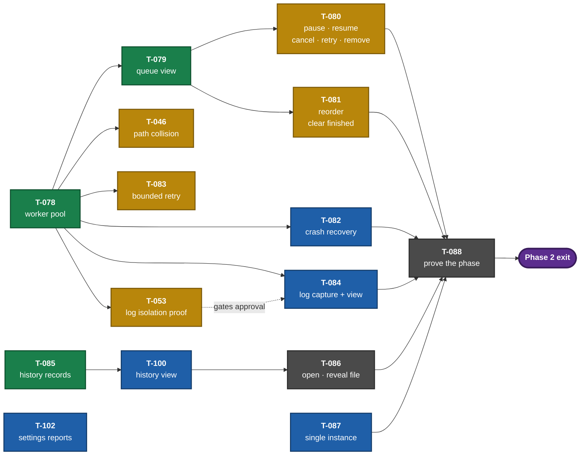

# IMPLEMENTATION_PLAN.md — Tracks & Trails

**Purpose:** Define the high-level delivery sequence.
**Authority:** Canonical for phase order, boundaries, and exit criteria.
**Owner:** Planner
**Maintainer:** Sean Kottman
**Status:** Active
**Last updated:** 2026-08-01
**Last reviewed:** 2026-08-01
**Update when:** Phase scope, delivery order, dependencies, or exit criteria change.
**Does not contain:** Individual coding tasks (`TASKS.md`), progress (`STATUS.md`).

---

## Sequencing principle

Phase 1 deliberately builds a **thin vertical slice through every architectural layer** —
UI → manager → IPC → worker → yt-dlp → SQLite — for a single download, rather than building
one complete layer at a time. The riskiest assumption in this project is `ARC-002` (the
per-job process model with IPC progress and hard cancellation). If it is wrong, that must
surface in Phase 1, while the cost of changing it is a rewrite of a few hundred lines rather
than the whole application.

Everything after Phase 1 is breadth on a proven spine.

---

## Phase 0 — Foundation

**Goal:** A runnable, tested, lint-clean skeleton with the environment questions answered.

**Prerequisites:** None.

### Deliverables

- ~~Python baseline confirmed against PySide6 wheel availability~~ — **done** (`T-002`): Python 3.14, PySide6 6.11.1
- ~~`pyproject.toml`, virtual environment, dependency set~~ — **done** (`T-001`)
- ~~Package skeleton matching `ARCHITECTURE.md` §4~~ — **done** (`T-001`)
- ~~ruff + mypy configured and passing~~ — **done** (`T-001`)
- ~~pytest + pytest-qt running~~ — **done** (`T-001`); layering-enforcement test is `T-005`
- ~~Git repository with `.gitignore`; `LICENSE`~~ — **done** (`T-004`)
- ~~`docs/DEVELOPMENT.md` created~~ — **done** (`T-001`, `DOC-002` trigger discharged)
- Layering-enforcement test (`T-005`)
- CI running lint, types, and tests on Linux and Windows (`T-006`)
- Frozen-build smoke test in CI proving `spawn` works from a frozen binary (`T-020`)
- A window that opens, shows the app icon, and closes cleanly on both platforms (`T-007`)

### Exit criteria

- `ruff check`, `ruff format --check`, `mypy src`, and `pytest` all pass locally and in CI
- The layering test fails when a deliberate `PySide6` import is added to `core/`
- The window launches on Linux **and** Windows from a clean checkout following only
  `docs/DEVELOPMENT.md`
- A frozen artifact spawns a child process without relaunching itself, on both platforms
- `LIC-001` is Accepted and `LICENSE` exists

**Exited 2026-07-26.** All five criteria verified rather than asserted:

| Criterion | Evidence |
|---|---|
| Four checks pass locally and in CI | Green locally; CI run `30215160820`, all five jobs |
| Layering test fails on a deliberate `PySide6` import in `core/` | Mutation run 2026-07-26: `test_module_respects_the_layer_rules[core/models.py]` failed, 108 others passed; restored |
| Window launches on Linux **and** Windows from a clean checkout | Linux: `T-007`. Windows: `T-026`'s `windows desktop` job runs the real `app.run` entry point under the real `windows` platform plugin and asserts the native `HWND`, visibility and title through the Win32 API |
| Frozen artifact spawns a child without relaunching itself, both platforms | `T-020`; `frozen ubuntu-latest` and `frozen windows-latest` green |
| `LIC-001` Accepted and `LICENSE` exists | Accepted; `LICENSE` present, MIT |

**What the phase exits with, named rather than hidden:** the subjective half of Windows
verification (`OPS-004`) — whether rendering *looks* right, whether Narrator *sounds* coherent,
whether the installer *feels* normal — is unverified and blocks first release, not this phase.
Installer behavior (`T-039`) has no automated gate yet. **Widget tab order does**, as of
2026-07-28: `T-040` asserts it under the real Windows platform plugin, per widget state, and both
`T-026` mutation classes were run on a real Windows desktop and killed (`COORD-R5` — this
sentence outlived being true).

**Risk retired:** PySide6 wheel availability on Python 3.14 was the phase's headline risk.
`T-002` closed it — PySide6 ships stable-ABI (`abi3`) wheels covering every Python ≥3.10, so
the baseline is not tied to PySide6's release cadence at all. Baseline is Python 3.14.

**Why freezing appears in Phase 0.** `REL-001` ships artifacts with no Python prerequisite,
which means `ARC-002` must work under PyInstaller — where a `spawn`ed child re-executes the
application binary rather than a Python interpreter. That is a recursive launch, not a subtle
bug, and no unfrozen test can catch it. `T-020` makes it a Phase 0 CI failure rather than a
Phase 5 discovery on top of a finished application.

---

## Phase 1 — Vertical slice: one download, end to end

**Goal:** Paste a URL, probe it, pick a preset, download it with live progress, cancel it.
Prove `ARC-002`.

**Prerequisites:** Phase 0 complete. **Satisfied 2026-07-26.**

> The 2026-07-25 amendment that distinguished Phase 0's *deliverables* from its *exit criteria*
> is **withdrawn as moot**, exactly as it said it would be once the Windows criterion was met.
> Phase 0 has formally exited, so the plain reading is now the true one and no distinction is
> needed. The episode is preserved in `ai/REVIEWS.md` and in `OPS-004`/`T-026`: the amendment
> existed because the criterion was believed unreachable without hardware, and `OPS-004`
> disproved that premise rather than the criterion being waived.

### Deliverables

- `core/models.py`, `core/job_state.py`, `core/errors.py` — domain and state machine
- `downloader/protocol.py` — the IPC message contract
- `downloader/worker.py` + `ytdlp_adapter.py` — yt-dlp in a spawned child process
- `downloader/manager.py` + `result_pump.py` — pool of one, progress to Qt signals
- `persistence/` — SQLite schema, migration runner, `JobRepository`
- Built-in presets and preset → yt-dlp options translation (`REQ-006`, `REQ-009`)
- Add-URL dialog with probe results (`REQ-001`, `REQ-002`, `REQ-005`)
- Single-job progress view with cancel (`REQ-014`, `REQ-015`)
- Recorded `info_dict` fixtures for adapter tests

### Exit criteria

- A real URL downloads to disk with accurate live progress and correct final bytes
- Cancel stops the download within 2 seconds with no orphaned process (verified on both
  platforms, `ps` / Task Manager)
- `kill -9` of the worker is reported as `WORKER_CRASH` and the app stays responsive
- Job state survives an application restart mid-download
- An unsupported URL produces a failed job showing the extractor's own message
- Worker code runs with no display attached (headless test passes)
- Verified on Linux **and** Windows
- Reviewed and signed off in `REVIEWS.md`

> **What "Windows" means here is `STARBASE`** (`OPS-005`, 2026-07-29): the maintainer's Windows 10
> 22H2 machine, which is both an interactive verification target and the self-hosted runner for the
> `windows desktop` job. A finding that reproduces only on a GitHub-hosted image and not there does
> not block this exit — `T-056` and `T-068` are open on exactly that basis.
>
**Exited 2026-07-29.** The Phase 1 exit review is recorded in `ai/REVIEWS.md`.

*(The first version of this table cited the layering test and `QT_QPA_PLATFORM=offscreen` as
evidence for the headless criterion. Neither establishes it — a static import guard is a different
claim, and offscreen selects a plugin rather than removing a display, so every worker test was
inheriting `DISPLAY` including the one whose docstring said otherwise. `P1EXIT-R1`. It also cited
the wrong test for the unsupported-URL row and called an inline `ExtractorError` a recorded
`info_dict` fixture — `P1EXIT-R2`. Both rows are rebuilt below; building the table is what exposed
them, which is the argument for having built it.)*

| Criterion | Evidence |
|---|---|
| A real URL downloads to disk with accurate live progress and correct final bytes | `T-037`, `test_a_url_becomes_a_file_with_the_bytes_it_reported`. Real yt-dlp, its generic extractor and its HTTP downloader against a local `http.server` — the §6 exception recorded for exactly this. The assertion joins the halves: the file's size equals both what the last progress message reported *and* what the queue recorded |
| Cancel stops the download within 2 seconds with no orphaned process | `T-013` and `T-019`. `CANCEL_BUDGET_SECONDS = 2.0` is asserted by `test_cancel_stops_a_real_in_flight_download_within_the_budget`, and the escalation path — a worker that ignores both the event and `SIGTERM` — by `test_a_worker_that_ignores_cancellation_is_killed_inside_the_budget`. Orphans are covered separately by `test_cancelling_a_download_kills_what_the_worker_spawned` and `test_a_worker_killed_from_outside_does_not_leave_its_grandchild_behind` |
| `kill -9` of the worker is reported as `WORKER_CRASH` and the app stays responsive | `test_a_killed_worker_becomes_worker_crash_with_its_exit_code` and `test_the_application_survives_a_worker_crash_and_can_start_another`. `test_a_worker_that_exits_zero_without_an_outcome_is_a_crash_not_a_success` covers the case `REQ-028` cares about most |
| Job state survives an application restart mid-download | `T-037`, `test_a_job_killed_mid_download_is_recovered_by_the_next_start` — a real `SIGKILL` to a separate interpreter with the row confirmed `RUNNING` first. `test_recovery_is_the_applications_own_and_not_the_tests` plants the row directly, so the claim is about startup rather than about what the previous test left behind |
| An unsupported URL produces a failed job showing the extractor's own message | `test_an_unsupported_url_fails_the_job_with_the_extractors_own_message` raises `UnsupportedError` through a real `run_session`, and asserts `UNSUPPORTED_URL` **and** the message by equality. `test_an_unsupported_url_shows_the_extractors_message_character_for_character` proves the UI shows that kind and message without paraphrase; `test_a_failed_probe_leaves_the_job_failed_and_recorded` proves the corresponding job is stored as `FAILED` with both values intact. Mutation-verified: removing the `UnsupportedError` row from the adapter's table makes it answer `EXTRACTOR_ERROR`, which the parent class would silently supply. **Limit, stated:** the error is injected at the `_extract` seam, so yt-dlp's own recognition of such a URL is not exercised |
| Worker code runs with no display attached | `test_the_worker_runs_in_a_real_spawned_process_with_no_display` — the scrub and the workload are now **one observation**: `monkeypatch.delenv` removes `DISPLAY` and `WAYLAND_DISPLAY` before `spawn` copies the environment, `_spawn_target` asserts their absence in the child, and that same child runs a real `run_session` whose message sequence is protocol-validated. Both halves mutation-verified: restoring the inherited environment fails, and injecting `os.environ["DISPLAY"]` into `run_session` fails. `test_the_worker_really_runs_with_no_display_attached` covers resolution separately |
| **Verified on Linux and Windows** | **Met with accepted residual risk.** Linux: the documented gate passed on the maintainer machine during the exit review — ruff and format clean, native and Windows-platform mypy clean, **1430 passed, 11 skipped, 2 deselected**. Windows: `T-073` run `30415333608` passed the full `STARBASE` gate — **1388 passed, 20 skipped** — with the unexplained one-time access violation retained as open Medium `T-074` and explicitly accepted by `OPS-007` |
| **Reviewed and signed off in `REVIEWS.md`** | **Met 2026-07-29.** The Phase 1 exit review approved all eight criteria, independently reran the Linux gate and criterion mutations, and recorded the `OPS-005` and `OPS-007` residuals rather than treating them as fixes |

> **The Windows half is measured** (`T-073`, 2026-07-29): run `30415333608` ran lint, format,
> Windows-platform types, the Qt baseline, the real-plugin desktop slice and the full suite on
> `STARBASE` — 1388 passed, 20 skipped, with ffmpeg present.
>
> **The Linux half is the maintainer's own machine** (`OPS-006`, 2026-07-29). A self-hosted runner
> on the development box would share its OS, packages and libraries, so it would record results
> without verifying anything the developer's own run does not already cover. What that gives up is
> named in the decision: a change that adds a **system-library** dependency would pass on a
> desktop and fail on a bare Linux install.
>
> **The exit review calls the criterion met with `OPS-007`'s residual accepted, not resolved.**
> The Windows suite exited once with an access violation in ordinary `ResultPump` delivery — the
> `ARC-002` path this phase exists to prove. The faulting object and product-versus-harness
> classification remain unknown. Three deliberate full-suite batches then produced **0 crashes in
> 51 runs**: 12 at `ea53c71` (run `30429327464`), 24 pre-`T-090` (run `30454206697`), and 15
> post-`T-090` at `35fc7ec` (run `30478557533`). Along with 60 isolated-test runs and 250
> in-process iterations, that is **361 attempts with no reproduction**. The pre-fix sample was
> already clean, so this does **not** establish `T-090` as the cause. `T-074` remains open at
> Medium with its acceptance criteria unmet; `T-092` owns the crash-dump trap, and recurrence
> reopens the decision.
>
> *(This previously read "roughly one run in four", which was the anecdote's denominator rather
> than a measurement.)*

---

## Phase 2 — Queue and concurrency

**Goal:** Turn one download into a managed queue.

**Prerequisites:** Phase 1 approved. `ARC-002` confirmed sound. **Satisfied 2026-07-29.**

**Status: in progress** (2026-08-01). **Nine of thirteen deliverables are built** — seven approved,
two awaiting review. Three more are Ready and one is Proposed. **Nothing is blocked on a machine any
more:** `OPS-005` was amended so hosted Windows carries the gate while `STARBASE` is offline, and
`17e7ba5` is the first fully green CI run since 2026-07-28.

*(These counts are transcribed from the table below rather than written beside it. `COORD-R5`
through `COORD-R11` are seven rounds of a hand-written summary drifting from the thing it
summarises, and an earlier draft of this line said "five approved, four in review, three not
started" against a table holding three, four, four and two.)*

### The shape of what is left

**Green is approved, amber awaits a verdict, blue is startable now, grey has not started.**
`T-046`, `T-083` and `T-102` are deliverables that `T-088` does not gate — they are correctness and
diagnostics rather than queue behaviour the phase proof exercises — so they carry no edge into it.

### Decisions taken during this phase

Recorded here because each one changed what a deliverable *is*, not merely how it was built:

| Decision | What it settled |
|---|---|
| `ARC-007` (+ amendment) | The settings surface is `settings.toml` plus one main-window control, and `CONCURRENCY_MAXIMUM = 16` |
| `ARC-008` | A `settings.toml` that exists and cannot be used **reports** rather than reverting silently. `T-102` implements it |
| `UX-001` | Pause is a queue-level drain; remove never deletes a file |
| `ARC-006` (+ `T-094`) | The single-instance guard is a `QLocalServer` named from the resolved database path, with an atomic Windows ownership primitive |
| `OPS-008` | The environment ownership gate's three blind spots stay open |
| **The `PAUSED` edges** (maintainer, 2026-07-31) | `RUNNING → PAUSED` and `PAUSED → RUNNING` were unreachable under `UX-001`, so `T-080` removed them **and the `JobStatus.PAUSED` member**. `REQ-017` in Phase 3 is the named reopening condition |
| **`P2PLAN-R7`** (maintainer, 2026-07-31) | Manual retry re-enters the queue at the back. Confirmed as a decision in its own right, **not** as something `P2PLAN-R1` settled |

### Deliverables

| # | Deliverable | Owner | State |
|---|---|---|---|
| 1 | Bounded concurrent worker pool, configurable limit (`REQ-013`). **The configuration surface is `ARC-007`**: `settings.toml` via `core/settings.py`, plus one control in the existing main window. The full `REQ-023` settings dialog stays Phase 4 | `T-078`, `T-097` | **Approved** 2026-07-30 (`0f9986f`) |
| 2 | Queue view: multi-job table, per-job status/progress | `T-079` | **Approved** 2026-07-31 (`da49a51`) |
| 3 | **Pause and resume are queue-level** (`UX-001`); cancel, retry and remove are per job (`REQ-015` as amended 2026-07-29). *(This read "per-job status/progress, pause/resume/retry/remove", which contradicted the amendment — `P2PLAN-R1`.)* | `T-080` | **Approved** 2026-08-01 (`05e5312`) |
| 4 | Reordering and clear-completed (`REQ-016`) | `T-081` | **Approved** 2026-08-01 (`eb1bd70`) |
| 5 | Output-path collision policy against the filesystem (`DAT-002`, `REQ-011`) | `T-046` | **Approved** 2026-08-01 (`9c5745a`). `T046-R1` was **Critical**: a converted download overwrote the user's file |
| 6 | Bounded retry with backoff for `NETWORK` failures only (`REQ-018`) | `T-083` | **Approved** 2026-08-01 (`97f96c0`). `UX-002` ratifies 3 attempts at 2s/4s/8s |
| 7 | History persistence and completed-download records (`REQ-020`) | `T-085`, `T-050`, `T-093` | **Approved** 2026-07-30 |
| 8 | A corrupt `settings.toml` reports rather than reverting silently (`ARC-008`) | `T-102` | **Approved** 2026-08-01 (`97f96c0`) |
| 9 | Crash recovery — interrupted jobs detected at startup and offered for retry (`REQ-012`) | `T-082` | **In review** 2026-08-01. The recovery always worked; composition threw the recovered ids away, so nobody was ever told |
| 10 | Per-job log capture and log view (`REQ-019`) | `T-084` | **In review** 2026-08-01. `T-053`, which gates its approval, is **Approved**. Found that yt-dlp's diagnostics were never captured at all |
| 11 | History view over those records | `T-100` | **In review** 2026-08-01 |
| 12 | Open file / reveal in file manager (`REQ-021`), from both views | `T-086` | **In review** 2026-08-01 (`46c1709`) |
| 13 | Single-instance guard (`A-004`, `ARC-006`) | `T-087` | **Approved** 2026-08-01 (`ea9d752`). Linux and hosted Windows both green, including racing starts |

*(Deliverable 5 was **added 2026-07-31**. `DAT-002` filed `T-046` as a Phase 2 task and this list
never named it — the same class as `P2PLAN-R8`, where the history records were listed and the view
that makes them reachable was not. A deliverable nothing lists is one nothing can report as
outstanding.)*

*(Deliverable 11 was added 2026-07-30 after `P2PLAN-R8`: this list named the records and not the
view, Phase 3 and 4 named neither, and `REQ-021` presupposes one. Phase 2's own clear-completed
plus `UX-001`'s remove-never-deletes leave the user unable to find their files without it.)*

**Carried, blocking nothing:** `T-099`, `T-101` and `T-103` are review follow-ups filed against
Phase 2 work. None is a deliverable and none gates the exit; they are listed in `TASKS.md`.

### Exit criteria

| # | Criterion | State | Evidence |
|---|---|---|---|
| 1 | Three concurrent downloads show independent accurate progress, UI interactive throughout (`NFR-001`) | **Met** — the user route exists as of `T-115` | Three claims, three owners (`T088-R2` — the phase test used to assert all three and observed only the first). **Three at once:** `test_three_real_workers_each_write_their_whole_file` — three real spawned processes, three distinct complete files. **Independent accurate progress:** `tests/ui/test_queue_view.py::test_three_concurrent_downloads_show_independent_progress` and `test_three_concurrent_downloads_each_keep_their_own_row`. **UI interactive:** `test_the_interface_stays_inside_its_budget_while_three_downloads_run`. Until `T-115` all of these started jobs through a route the UI did not offer for more than one; pasting URLs and pressing Add now does it |
| 2 | Hard-killing the app mid-queue and restarting restores the queue with correct states | **Met** | `test_a_hard_kill_mid_queue_restores_every_job_state_at_the_next_start` — `SIGKILL` with three workers downloading and two jobs never started, then a **real composed application started against the killed database** (`T088-R3`: it previously called the repository itself while claiming to be a restart). In-flight rows recover, never-started rows are left alone, and the offer appears |
| 3 | Concurrency limit respected exactly; lowering it drains cleanly, and so does pausing | **Met** | `test_the_pool_never_exceeds_the_configured_limit` samples **both** the rows and the actual process count over a whole run. The lowering and pause halves are `T-078` and `T-080`, both approved |
| 4 | A second launch attaches to or refuses in favour of the running instance | **Met** | `test_a_second_launch_refuses_in_favour_of_the_running_instance`, against a first instance with a **full pool** — the state a guard built on polling would be likeliest to let through. `T-087`'s three Windows cases passed on `check (windows-latest)` |
| 5 | No worker process outlives application exit, on both platforms | **Met on Linux and hosted Windows** — measured, not asserted: **all five phase-exit tests passed on `windows-latest`** in run `30712201443`, and the `T-115` case reported `XFAIL` there as designed | `test_no_worker_outlives_a_hard_kill_with_a_full_pool` — the worker set obtained independently of what is killed, the resource tracker excluded by being identified, and asserted non-empty before the kill (`T072-R1`) |
| 6 | Reviewed and signed off | **Not met** | Four deliverables await review: `T-100`, `T-086`, `T-084`, `T-082` |
| 7 | *(Found by `T-088`)* A user can actually start a queue | **Met — `T-115` fixed 2026-08-01** | `DownloadManager.admit()` expresses durable intent where `start()` demanded a session; the add dialog admits every job it persists, and `compose()` admits durable `QUEUED` rows **after** recovery so nothing recovered restarts unattended (`T081-R4`). `test_every_queued_job_eventually_starts_as_slots_free` drives the **Add route alone** — no priming — and passes; `test_a_queue_left_by_a_previous_run_starts_on_the_next_launch` covers restart and `test_a_paused_queue_admits_and_still_starts_nothing` covers `UX-001`. **The gate worked**: it reported `XPASS(strict)` on the first run after the fix and was then inverted |

**What the evidence does *not* cover**, stated because building Phase 1's table is what exposed two
wrong rows (`P1EXIT-R1`, `P1EXIT-R2`):

- **A real Windows desktop session.** The phase-exit tests themselves *do* run on `windows-latest`
  and passed there (run `30712201443`); what is uncovered is the interactive desktop. `STARBASE`
  is offline and `OPS-005`'s amendment puts the gate on the hosted job; the desktop slice (`T-026`,
  `T-040`) is covered nowhere.
- **Real network conditions.** The media server is localhost.
- **`NFR-001` as a person experiences it.** Criterion 1's test asserts the event loop keeps being
  serviced, not that anyone would call it smooth.
- **An `ffmpeg` grandchild surviving a kill.** These presets do not spawn one; `T-019`'s own tests
  cover the grandchild case for a single worker.

> **What stood between here and the exit was a runner, and that changed on 2026-08-01.**
>
> The GitHub-hosted runners returned after executing zero steps since 2026-07-30, and the first
> working run was **red on both platforms** with four failures that had reached `main` unrun.
> Those are corrected; `7516f61` is green on `ubuntu-latest`, `windows-latest` and both frozen jobs.
>
> **`STARBASE` is offline** — registered, not connected, and the maintainer is away from it.
> `OPS-005` was **amended 2026-08-01**: hosted Windows carries the Windows gate while that holds,
> because this entry's own reasoning — *blocking on an environment nobody can reach is not a gate,
> it is a stall* — now points the other way. The `windows desktop` job is skipped unless
> `STARBASE_AVAILABLE` is set, so an offline runner stops holding every run open at `queued`.
>
> **Two things still wait for that machine**, and neither gates this phase: the desktop slice
> (`T-026`, `T-040` — a hosted image has no interactive desktop session) and the subjective residue
> `OPS-004` names, plus `T-074`'s segfault environment and `T-092`'s crash-dump capture.

---

## Phase 3 — Format and content depth

**Goal:** Expose yt-dlp's real capability. This is the phase that separates the app from a
one-button downloader.

**Prerequisites:** Phase 2 approved.

**Trigger:** `docs/UX_SPEC.md` is created at the start of this phase (`DOC-002`). **Owned by
`T-105`** as of 2026-08-01 — it was a scheduled trigger with no task behind it, which is how a
phase starts without the document it is supposed to start with.

**Decomposed 2026-08-01** into `T-107`–`T-114`. Before that this phase had **zero** tasks against
seven deliverables, so any statement of its size came from prose rather than from work anybody had
broken down — and Phase 1 listed nine deliverables and produced fifty tasks. Eight is the starting
point, not the total.

### Deliverables

| Deliverable | Owner | Risk |
|---|---|---|
| Sortable format table (`REQ-003`) | `T-107` | Medium — the projection is where `NFR-008`'s churn lands |
| Separate video/audio selection and merge (`REQ-008`) | `T-108` | Medium — `T-061` is what a wrong ffmpeg check costs |
| Post-processing, seven options (`REQ-010`) | `T-109` | **High** — `T-077` found four of five Phase 1 options never produced a file |
| Playlist probing and per-entry selection (`REQ-004`) | `T-110` | **High** — one URL is one job today; a playlist is one probe producing N |
| User-defined presets (`REQ-007`) | `T-111` | Medium — persisted state, and where it lives needs a decision |
| Output template editor with live preview (`REQ-011`) | `T-112` | Medium — preview and real path must be one function |
| Cross-restart resume of partial downloads (`REQ-017`) | `T-113` | **High** — reopens `UX-001` and `T-080`'s `PAUSED` removal |
| Duplicate-URL detection and warning (`REQ-022`) | `T-114` | Low |

**Every one of them depends on `T-105`**, which writes `docs/UX_SPEC.md` — the trigger this phase
already carried and which had no task behind it until 2026-08-01.

**Two are structural rather than additive**, and are the reason this phase is not smaller than
Phase 2 despite listing fewer deliverables: `T-110` changes what a *job* is, and `T-113` reopens two
accepted decisions by design.

### Exit criteria

- The format table matches `yt-dlp -F` output for a fixture set of URLs
- A separate video + audio selection merges correctly via ffmpeg on both platforms
- Output template preview matches the actual written path in every tested case, including
  titles containing characters illegal on Windows
- Path containment holds: no rendered template escapes the output directory
- A partial download resumes after restart, or clearly states it cannot
- Reviewed and signed off

---

## Phase 4 — Settings, polish, and accessibility

**Goal:** Make it pleasant, configurable, and usable without a mouse.

**Prerequisites:** Phase 3 approved.

### Deliverables

- Full settings dialog covering `REQ-023`
- Network options: rate limit, proxy, retry policy
- Cookie source configuration — browser profile or cookies file — with redaction verified
  (`REQ-026`, `REQ-EXCL-003`)
- In-app yt-dlp version display and update action (`REQ-025`, `OPS-002`)
- ffmpeg detection, capability reporting, and override path (`REQ-024`)
- Theme: brand palette, light and dark (`ARCHITECTURE.md` §8)
- Accessibility pass: keyboard navigation, focus order, screen-reader labels (`NFR-005`)
- Error-surface pass: every taxonomy class has a tested, actionable presentation (`NFR-006`)

### Exit criteria

- Every function is reachable by keyboard alone, verified end to end **on Linux**
- A screen reader announces every control meaningfully **on Linux (Orca)**. On Windows this
  splits per `OPS-004`: that the UI Automation tree exposes a correct name and role for every
  control is automated by `T-026`; whether Narrator's announcements are *coherent* is
  subjective, stays with the pre-release Windows session, and is recorded as unverified until
  then — this phase may exit with that gap named, but not hidden.
- No information is conveyed by color alone
- Logs contain no cookie contents, cookie paths, proxy credentials, or token-like query
  parameters — verified by an automated redaction test (`NFR-007`)
- Updating yt-dlp in-app changes the reported version and reverting restores the baseline
- Reviewed and signed off

---

## Phase 5 — Distribution

**Goal:** Installable artifacts for both platforms and a repeatable release process.

**Prerequisites:** Phase 4 approved.

**Trigger:** `docs/RELEASE.md`, `SECURITY.md`, and `CHANGELOG.md` are created here
(`DOC-002`). A `REL-` decision recording the Linux packaging format must be accepted before
the first build. **That decision does not exist** — the only `REL-` entry is `REL-001`, which
decides artifacts are frozen and says nothing about format. **`T-106` owns taking it** (filed
2026-08-01), and it is worth taking early: AppImage, Flatpak and system packages differ in how the
application finds `ffmpeg` and where it may write, which reaches back into `REQ-024` and `NFR-004`
long before Phase 5.

### Deliverables

- Windows: PyInstaller one-dir build + Inno Setup installer, ffmpeg bundled (`OPS-001`)
- Linux: packaging per the `REL-` decision
- Bundled yt-dlp baseline pinned and recorded (`OPS-002`)
- License texts for Qt, ffmpeg, and yt-dlp shipped with the distribution (`LIC-001`)
- Versioning policy, release gate, and rollback procedure documented
- First tagged release

### Exit criteria

- A clean Windows 10/11 machine with no Python installs and runs the app successfully
- A clean Linux machine installs and runs it successfully
- Installer behavior is verified on the runner by `T-039` — silent install, file and shortcut
  placement, launch, uninstall and removal (`OPS-004`)
- **The Windows manual verification session is complete** and recorded in `REVIEWS.md`
  (`ai/TESTING.md` §8 item 15). `OPS-004` shrank this to the subjective residue — whether the
  rendering *looks* right, whether Narrator *sounds* coherent, whether the installer *feels*
  normal, shell foreground and file-association behavior, and long-running stability. It still
  requires a real Windows desktop and is still the one Phase 5 item that cannot be satisfied
  from the current development environment — arrange it before the phase starts, not at its end.
- Qt is dynamically linked in every artifact (`NFR-009`)
- The full test suite and the release gate pass on both platforms
- Cold start under 3 seconds on the reference machine (`NFR-002`)
- All MVP acceptance criteria (`REQUIREMENTS.md` §11) pass on both platforms
- Release review completed and recorded

---

## Deferred beyond Phase 5

Not scheduled: scheduled/deferred downloads, per-site profiles, watch-folder import, browser
"send to" integration, SponsorBlock, music-library organization and tagging, bandwidth
scheduling, macOS support. See `REQUIREMENTS.md` §7. None may be started without a phase
being added here first.

## Phase-level risks

| Risk | Phase | Mitigation |
|---|---|---|
| ~~PySide6 has no wheel for Python 3.14~~ | 0 | **Closed** by `T-002` — `abi3` wheels serve all Python ≥3.10 |
| `ARC-002` process model proves unworkable | 1 | Vertical slice first; failure is cheap and early |
| Windows `spawn` behaves differently than Linux | 1 | `spawn` everywhere from the start; CI on both from Phase 0 |
| No Windows machine exists — CI is the only Windows environment | all | `OPS-004` narrowed this: the runner is a real desktop, so `T-026`/`T-039` automate the objective half. Name what CI cannot assert and discharge that subjective residue in one pre-release session |
| yt-dlp changes option or `info_dict` shape | ongoing | Churn confined to two modules (`NFR-008`); fixtures pin the contract |
| Format-selection UI becomes unusably complex | 3 | Presets are the default path; the table is progressive disclosure |
| Windows packaging of a Qt app proves painful | 5 | Prototype the build in Phase 0 CI (`T-020`), not first at Phase 5 |
| Frozen build breaks `spawn` (recursive launch) | 0 | `freeze_support()` + `T-020` CI assertion from Phase 0 |
| yt-dlp gains a compiled dependency, breaking the `OPS-002` updater | ongoing | Purity re-checked at every release gate (`TESTING.md` §8) |
| **CI stops executing entirely, so "a red run blocks" stops meaning anything** | 2 | **Live as of 2026-07-31**, not hypothetical: no job has run a step since 2026-07-30, hosted jobs fail before step one and the self-hosted job is starved. Measured in `STATUS.md`. The mitigation is that it is *visible* — a zero-step failure must never be read as a test failure, and no task may be reported as gated by CI until a run executes a step. It blocks Phase 2's exit criterion 5, not its tasks |
| License choice blocks public release | 0 | `LIC-001` resolved as a Phase 0 exit criterion |
