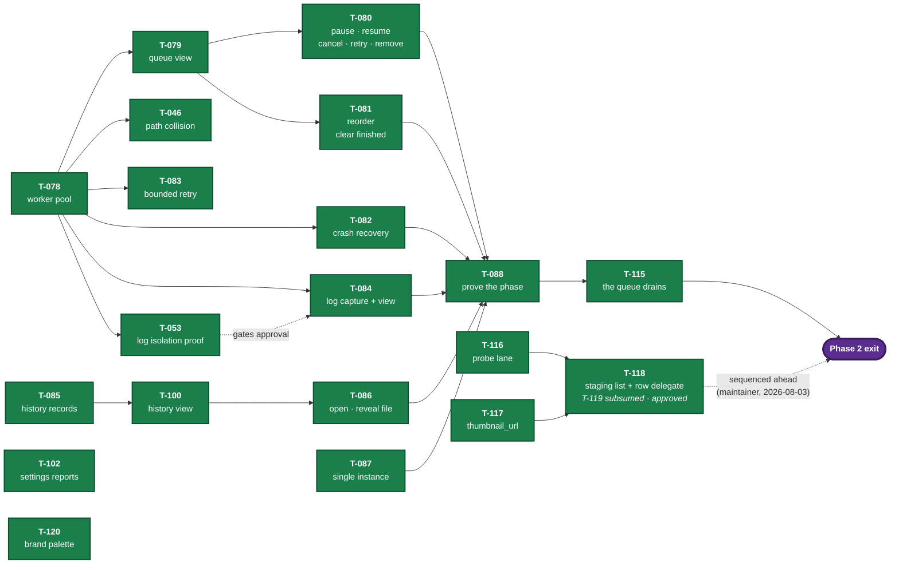

# IMPLEMENTATION_PLAN.md — Tracks & Trails

**Purpose:** Define the high-level delivery sequence.
**Authority:** Canonical for phase order, boundaries, and exit criteria.
**Owner:** Planner
**Maintainer:** Sean Kottman
**Status:** Active
**Last updated:** 2026-08-07 — Phase 4.5 added (option coverage), and `T-181` added to Phase 3
**Last reviewed:** 2026-08-01
**Update when:** Phase scope, delivery order, dependencies, or exit criteria change.
**Does not contain:** Individual coding tasks (`TASKS.md`), progress (`STATUS.md`).

---

## Sequencing principle

Phase 1 deliberately builds a **thin vertical slice through every architectural layer** —
UI → manager → IPC → worker → yt-dlp → SQLite — for a single download, rather than building
one complete layer at a time. The riskiest assumption in this project is `ARC-002` (the
per-job process model with IPC progress and hard cancellation). If it is wrong, that must
surface in Phase 1, while the cost of changing it is a rewrite of a few hundred lines rather
than the whole application.

Everything after Phase 1 is breadth on a proven spine.

---

## Phase 0 — Foundation

**Goal:** A runnable, tested, lint-clean skeleton with the environment questions answered.

**Prerequisites:** None.

### Deliverables

- ~~Python baseline confirmed against PySide6 wheel availability~~ — **done** (`T-002`): Python 3.14, PySide6 6.11.1
- ~~`pyproject.toml`, virtual environment, dependency set~~ — **done** (`T-001`)
- ~~Package skeleton matching `ARCHITECTURE.md` §4~~ — **done** (`T-001`)
- ~~ruff + mypy configured and passing~~ — **done** (`T-001`)
- ~~pytest + pytest-qt running~~ — **done** (`T-001`); layering-enforcement test is `T-005`
- ~~Git repository with `.gitignore`; `LICENSE`~~ — **done** (`T-004`)
- ~~`docs/DEVELOPMENT.md` created~~ — **done** (`T-001`, `DOC-002` trigger discharged)
- Layering-enforcement test (`T-005`)
- CI running lint, types, and tests on Linux and Windows (`T-006`)
- Frozen-build smoke test in CI proving `spawn` works from a frozen binary (`T-020`)
- A window that opens, shows the app icon, and closes cleanly on both platforms (`T-007`)

### Exit criteria

- `ruff check`, `ruff format --check`, `mypy src`, and `pytest` all pass locally and in CI
- The layering test fails when a deliberate `PySide6` import is added to `core/`
- The window launches on Linux **and** Windows from a clean checkout following only
  `docs/DEVELOPMENT.md`
- A frozen artifact spawns a child process without relaunching itself, on both platforms
- `LIC-001` is Accepted and `LICENSE` exists

**Exited 2026-07-26.** All five criteria verified rather than asserted:

| Criterion | Evidence |
|---|---|
| Four checks pass locally and in CI | Green locally; CI run `30215160820`, all five jobs |
| Layering test fails on a deliberate `PySide6` import in `core/` | Mutation run 2026-07-26: `test_module_respects_the_layer_rules[core/models.py]` failed, 108 others passed; restored |
| Window launches on Linux **and** Windows from a clean checkout | Linux: `T-007`. Windows: `T-026`'s `windows desktop` job runs the real `app.run` entry point under the real `windows` platform plugin and asserts the native `HWND`, visibility and title through the Win32 API |
| Frozen artifact spawns a child without relaunching itself, both platforms | `T-020`; `frozen ubuntu-latest` and `frozen windows-latest` green |
| `LIC-001` Accepted and `LICENSE` exists | Accepted; `LICENSE` present, MIT |

**What the phase exits with, named rather than hidden:** the subjective half of Windows
verification (`OPS-004`) — whether rendering *looks* right, whether Narrator *sounds* coherent,
whether the installer *feels* normal — is unverified and blocks first release, not this phase.
Installer behavior (`T-039`) has no automated gate yet. **Widget tab order does**, as of
2026-07-28: `T-040` asserts it under the real Windows platform plugin, per widget state, and both
`T-026` mutation classes were run on a real Windows desktop and killed (`COORD-R5` — this
sentence outlived being true).

**Risk retired:** PySide6 wheel availability on Python 3.14 was the phase's headline risk.
`T-002` closed it — PySide6 ships stable-ABI (`abi3`) wheels covering every Python ≥3.10, so
the baseline is not tied to PySide6's release cadence at all. Baseline is Python 3.14.

**Why freezing appears in Phase 0.** `REL-001` ships artifacts with no Python prerequisite,
which means `ARC-002` must work under PyInstaller — where a `spawn`ed child re-executes the
application binary rather than a Python interpreter. That is a recursive launch, not a subtle
bug, and no unfrozen test can catch it. `T-020` makes it a Phase 0 CI failure rather than a
Phase 5 discovery on top of a finished application.

---

## Phase 1 — Vertical slice: one download, end to end

**Goal:** Paste a URL, probe it, pick a preset, download it with live progress, cancel it.
Prove `ARC-002`.

**Prerequisites:** Phase 0 complete. **Satisfied 2026-07-26.**

> The 2026-07-25 amendment that distinguished Phase 0's *deliverables* from its *exit criteria*
> is **withdrawn as moot**, exactly as it said it would be once the Windows criterion was met.
> Phase 0 has formally exited, so the plain reading is now the true one and no distinction is
> needed. The episode is preserved in `ai/REVIEWS.md` and in `OPS-004`/`T-026`: the amendment
> existed because the criterion was believed unreachable without hardware, and `OPS-004`
> disproved that premise rather than the criterion being waived.

### Deliverables

- `core/models.py`, `core/job_state.py`, `core/errors.py` — domain and state machine
- `downloader/protocol.py` — the IPC message contract
- `downloader/worker.py` + `ytdlp_adapter.py` — yt-dlp in a spawned child process
- `downloader/manager.py` + `result_pump.py` — pool of one, progress to Qt signals
- `persistence/` — SQLite schema, migration runner, `JobRepository`
- Built-in presets and preset → yt-dlp options translation (`REQ-006`, `REQ-009`)
- Add-URL dialog with probe results (`REQ-001`, `REQ-002`, `REQ-005`)
- Single-job progress view with cancel (`REQ-014`, `REQ-015`)
- Recorded `info_dict` fixtures for adapter tests

### Exit criteria

- A real URL downloads to disk with accurate live progress and correct final bytes
- Cancel stops the download within 2 seconds with no orphaned process (verified on both
  platforms, `ps` / Task Manager)
- `kill -9` of the worker is reported as `WORKER_CRASH` and the app stays responsive
- Job state survives an application restart mid-download
- An unsupported URL produces a failed job showing the extractor's own message
- Worker code runs with no display attached (headless test passes)
- Verified on Linux **and** Windows
- Reviewed and signed off in `REVIEWS.md`

> **What "Windows" means here is `STARBASE`** (`OPS-005`, 2026-07-29): the maintainer's Windows 10
> 22H2 machine, which is both an interactive verification target and the self-hosted runner for the
> `windows desktop` job. A finding that reproduces only on a GitHub-hosted image and not there does
> not block this exit — `T-056` and `T-068` are open on exactly that basis.
>
**Exited 2026-07-29.** The Phase 1 exit review is recorded in `ai/REVIEWS.md`.

*(The first version of this table cited the layering test and `QT_QPA_PLATFORM=offscreen` as
evidence for the headless criterion. Neither establishes it — a static import guard is a different
claim, and offscreen selects a plugin rather than removing a display, so every worker test was
inheriting `DISPLAY` including the one whose docstring said otherwise. `P1EXIT-R1`. It also cited
the wrong test for the unsupported-URL row and called an inline `ExtractorError` a recorded
`info_dict` fixture — `P1EXIT-R2`. Both rows are rebuilt below; building the table is what exposed
them, which is the argument for having built it.)*

| Criterion | Evidence |
|---|---|
| A real URL downloads to disk with accurate live progress and correct final bytes | `T-037`, `test_a_url_becomes_a_file_with_the_bytes_it_reported`. Real yt-dlp, its generic extractor and its HTTP downloader against a local `http.server` — the §6 exception recorded for exactly this. The assertion joins the halves: the file's size equals both what the last progress message reported *and* what the queue recorded |
| Cancel stops the download within 2 seconds with no orphaned process | `T-013` and `T-019`. `CANCEL_BUDGET_SECONDS = 2.0` is asserted by `test_cancel_stops_a_real_in_flight_download_within_the_budget`, and the escalation path — a worker that ignores both the event and `SIGTERM` — by `test_a_worker_that_ignores_cancellation_is_killed_inside_the_budget`. Orphans are covered separately by `test_cancelling_a_download_kills_what_the_worker_spawned` and `test_a_worker_killed_from_outside_does_not_leave_its_grandchild_behind` |
| `kill -9` of the worker is reported as `WORKER_CRASH` and the app stays responsive | `test_a_killed_worker_becomes_worker_crash_with_its_exit_code` and `test_the_application_survives_a_worker_crash_and_can_start_another`. `test_a_worker_that_exits_zero_without_an_outcome_is_a_crash_not_a_success` covers the case `REQ-028` cares about most |
| Job state survives an application restart mid-download | `T-037`, `test_a_job_killed_mid_download_is_recovered_by_the_next_start` — a real `SIGKILL` to a separate interpreter with the row confirmed `RUNNING` first. `test_recovery_is_the_applications_own_and_not_the_tests` plants the row directly, so the claim is about startup rather than about what the previous test left behind |
| An unsupported URL produces a failed job showing the extractor's own message | `test_an_unsupported_url_fails_the_job_with_the_extractors_own_message` raises `UnsupportedError` through a real `run_session`, and asserts `UNSUPPORTED_URL` **and** the message by equality. `test_an_unsupported_url_shows_the_extractors_message_character_for_character` proves the UI shows that kind and message without paraphrase; `test_a_failed_probe_leaves_the_job_failed_and_recorded` proves the corresponding job is stored as `FAILED` with both values intact. Mutation-verified: removing the `UnsupportedError` row from the adapter's table makes it answer `EXTRACTOR_ERROR`, which the parent class would silently supply. **Limit, stated:** the error is injected at the `_extract` seam, so yt-dlp's own recognition of such a URL is not exercised |
| Worker code runs with no display attached | `test_the_worker_runs_in_a_real_spawned_process_with_no_display` — the scrub and the workload are now **one observation**: `monkeypatch.delenv` removes `DISPLAY` and `WAYLAND_DISPLAY` before `spawn` copies the environment, `_spawn_target` asserts their absence in the child, and that same child runs a real `run_session` whose message sequence is protocol-validated. Both halves mutation-verified: restoring the inherited environment fails, and injecting `os.environ["DISPLAY"]` into `run_session` fails. `test_the_worker_really_runs_with_no_display_attached` covers resolution separately |
| **Verified on Linux and Windows** | **Met with accepted residual risk.** Linux: the documented gate passed on the maintainer machine during the exit review — ruff and format clean, native and Windows-platform mypy clean, **1430 passed, 11 skipped, 2 deselected**. Windows: `T-073` run `30415333608` passed the full `STARBASE` gate — **1388 passed, 20 skipped** — with the unexplained one-time access violation retained as open Medium `T-074` and explicitly accepted by `OPS-007` |
| **Reviewed and signed off in `REVIEWS.md`** | **Met 2026-07-29.** The Phase 1 exit review approved all eight criteria, independently reran the Linux gate and criterion mutations, and recorded the `OPS-005` and `OPS-007` residuals rather than treating them as fixes |

> **The Windows half is measured** (`T-073`, 2026-07-29): run `30415333608` ran lint, format,
> Windows-platform types, the Qt baseline, the real-plugin desktop slice and the full suite on
> `STARBASE` — 1388 passed, 20 skipped, with ffmpeg present.
>
> **The Linux half is the maintainer's own machine** (`OPS-006`, 2026-07-29). A self-hosted runner
> on the development box would share its OS, packages and libraries, so it would record results
> without verifying anything the developer's own run does not already cover. What that gives up is
> named in the decision: a change that adds a **system-library** dependency would pass on a
> desktop and fail on a bare Linux install.
>
> **The exit review calls the criterion met with `OPS-007`'s residual accepted, not resolved.**
> The Windows suite exited once with an access violation in ordinary `ResultPump` delivery — the
> `ARC-002` path this phase exists to prove. The faulting object and product-versus-harness
> classification remain unknown. Three deliberate full-suite batches then produced **0 crashes in
> 51 runs**: 12 at `ea53c71` (run `30429327464`), 24 pre-`T-090` (run `30454206697`), and 15
> post-`T-090` at `35fc7ec` (run `30478557533`). Along with 60 isolated-test runs and 250
> in-process iterations, that is **361 attempts with no reproduction**. The pre-fix sample was
> already clean, so this does **not** establish `T-090` as the cause. `T-074` remains open at
> Medium with its acceptance criteria unmet; `T-092` owns the crash-dump trap, and recurrence
> reopens the decision.
>
> *(This previously read "roughly one run in four", which was the anecdote's denominator rather
> than a measurement.)*

---

## Phase 2 — Queue and concurrency

**Goal:** Turn one download into a managed queue.

**Prerequisites:** Phase 1 approved. `ARC-002` confirmed sound. **Satisfied 2026-07-29.**

**Status: everything buildable is built and approved; what remains is the exit itself**
(2026-08-03). `T-118` — the Phase 3 task sequenced ahead of this exit — is **approved with
follow-ups at `53b07ec`**, so criterion 6 was no longer waiting on a deliverable, and it is now **Met** — signed off 2026-08-05 at `8de5a72`. Criterion 8, added by maintainer ruling on 2026-08-04, is **met on the maintainer's evidence**: the 40-row built-window run passed on `kirk`, 2026-08-05 (`ai/evidence/2026-08-05-criterion-8-third-run.md`), and CI is green on the candidate. **Phase 2 is exited**: all thirteen deliverables approved and all eight exit criteria met, signed off 2026-08-05 at `8de5a72`. Criterion 6 was requested on 2026-08-05 and is in progress. `ai/REVIEWS.md` holds every verdict, and **no tally is kept here** — a count beside the record is a second copy of it, and it drifts the moment another verdict lands. It read *"three times"* against five. *(This said "criterion 6 is the only thing left" and was written before criterion 8 existed — a sentence that stayed true-looking while the criteria changed underneath it.)*

**The Blocked list was re-read on 2026-08-03** (`P2EXIT-R5`: this paragraph outlived the work it
asked for). Only `T-066` was genuinely unblocked — its frozen-artifact evidence now exists — and it
moved to `## Ready`. `T-092` was never blocked on the machine's availability but on somebody being
at it; `T-056` already had its `STARBASE` evidence and that is the finding; `T-033` waits on a
maintainer decision; `T-039` on a Phase 5 installer. `T-068`'s remaining half got *harder*, because
hosted Windows no longer runs.

**The gate was rebuilt on the way here.** Routing Windows to `STARBASE` to stop spending hosted
minutes put three Windows jobs on one runner slot, turning a 17-minute run into 32 and making the
gate the bottleneck rather than the safety net. Measured in run `30861672178` and acted on: the
duplicate Windows suite dropped while `WINDOWS_RUNNER` is set, and the desktop virtualenv persisted
between runs. A third change — moving the Windows suite off the push path — **was reversed the same
day** by `P2EXIT-R4` and `OPS-010`: it was made for wall-clock and then justified with the
hosted-minute constraint, which does not apply to a job running on the maintainer's own machine.
The full suite runs on every push on both platforms again. What changed is that **Linux answers in
~7 minutes and Windows answers later**, asynchronously, and work continues while it does.
`ai/TESTING.md` §10 is canonical for what runs when. No test was deleted or skipped; `T-123` is
filed to evaluate whether the suite can run in parallel.
**Thirteen of thirteen deliverables are approved**, the last four on 2026-08-01. **The exit review
happened on 2026-08-03 and Phase 2 did not exit** (`ai/REVIEWS.md`, submitted head `5eb2611`).
Criteria 2, 3, 4 and 7 met; **1 and 5 not met**, because the tests named as their evidence pass
with their subject removed (`P2EXIT-R1`, `P2EXIT-R2`, now `T-127`); 6 not met while any finding is
open. Two more findings were procedural: `T-122` was not yet a sound timing gate (`P2EXIT-R3`) and
the CI rewrite changed an accepted decision without a ruling (`P2EXIT-R4`, now `OPS-010`).

Phase 1's exit review found two wrong rows in the same table; this one found two more, in the same
way — by rebuilding the table against the repository rather than reading the claim. **The lesson
holds a third time: a criteria table is a claim until somebody who did not write it checks it.**

All five findings are answered as of 2026-08-03 and await re-review.

**`UX-005` is implemented in full** as of 2026-08-04 — `T-124`, `T-125` and `T-126`, all three
sequenced in before the exit by that decision and all three complete and awaiting review. The
window is two tabs over one list with no detail pane, every verb is on the row, the format control
appears exactly while `retarget()` would accept it, and history removal exists because `DAT-005`
now says what removal means. **`REQ-020` is amended** by that decision, which is the first
requirement change since the phase began.

Three things that came out of doing it, none of which was in the plan:

- **The detail pane was the only route to Cancel and Retry**, so removing it and adding the row's
  verbs could not be separate commits. A tabs-first commit would have shipped a window where a
  running download cannot be stopped.
- **`JobProgressView.detach` had no test outside a composition test about the pane.** `UX-005`
  defers that widget's fate, so its guarantee was moved to a view-level test *before* the pane's
  tests were deleted — otherwise the deferral would have been a silent deletion.
- **`DAT-005` was obtained rather than assumed.** `UX-005` §9 describes a removal control and
  refuses to specify it; writing the button would have been the decision.

**`T-118` landed before this phase exits**, carrying `T-119`'s scope after the two were merged.
Maintainer decision, 2026-08-03. It is a Phase 3 task and not a Phase 2 deliverable, so this was a
sequencing choice rather than a scope change — but it was the only thing keeping `main` red, and
criterion 5 is evidenced by CI. An exit submitted against a red board invites rejection on that
alone. **It is now approved**, so what stood between here and the exit at that point was criterion 6 alone. *(Written 2026-08-03. Criterion 8 was added the next day and is Not met, so "criterion 6 alone" has not been current since — the dated reasoning is kept, the live claim is not.)*

**`T-118` is approved with follow-ups at `53b07ec`** (2026-08-03), after four rounds of changes
requested and four corrections. The first built the shared delegate and carried `T-119`'s scope. The second answered three blocking findings
that were one mistake — the per-row control's slot was reserved and painted nothing, the literal
selector was elided to nothing at a realistic width, and the thumbnail *cleanup* still blocked the
GUI thread while the fetch did not. The third answered two Highs **the second round created or left
behind**: deleting a store still waited on its child thread pool and let workers emit through a
freed object, and resetting the model for every value change orphaned an open format control. The
fourth answers the second of those **escalated to Critical**: the model's index mapping still read
live staging rather than the snapshot the view held, so a format chosen for one row was written to
the *next* one when a preceding row left the list mid-edit — a silently wrong per-URL download.

*(All findings resolved; `T118-R17` and `COORD-R21` carry forward as non-blocking follow-ups. The
pattern across all four
rounds is one thing: a correction verified by a test that agreed with the implementation rather
than checking it against the finding. The fourth round found the previous round's re-entrancy guard
setting its flag and never reading it — caught by a mutation that could not find the branch it was
deleting, not by anybody reading the code.)*

**`T-118` is no longer what is red.** Run `30853680183` ran the correction's nine tests on hosted
`windows-latest` — the runner where `T118-R10`'s flap was observed — and on `STARBASE`, and all
nine passed on both. `T118-R10` is **Resolved**.

**The exact-head run is in:** `30859578131` at `53b07ec` put every round on Windows at last.
`STARBASE` passed the full suite; hosted `windows-latest` reported **1 failed / 1971 passed**, and
the one failure is `T-118`'s own scaling gate rather than the product — the absolute-budget test in
the same job did the identical 500-URL resolve under its 1.0 s budget. `T-121` did not recur.

**What is red now is `T-122`'s ratio oracle** (`COORD-R21`). In exact-head run `30859578131` the
one hosted-Windows failure was `T-118`'s own paste-scaling gate, which rejects a transient host
pause; the product passed. `T-122` owns removing it as a required gate while keeping the 500-row
absolute budget and the structural control count.

**`T-121` did not recur in that run, which is not the same as resolved.** Its entry stays Proposed:
the phase-exit test's own localhost clip server aborted a loopback connection on hosted Windows in
run `30853680183`, so one of five downloads failed and a test about *admission* went red while
reporting that zero jobs stayed queued — the behaviour it exists to prove, holding. `STARBASE`
passed it both times. The fixture defect and its misleading message are still there; one green run
did not fix them, it just did not trigger them.

**The standing preference remains `STARBASE` over hosted runners** (maintainer, 2026-08-03), since
hosted Actions minutes are nearly exhausted. `ci.yml`'s Windows `check` job already reads
`vars.WINDOWS_RUNNER`, so routing is a repository variable rather than a workflow change — **but
`check`'s `setup-python` is unguarded**, unlike `frozen`'s, so pointing it at the desktop today
would run the real Python installer there and repeat the incident `frozen`'s own comment records at
run `30823595744`. Guarding it is the prerequisite, and it is nobody's task yet.

**Nothing is blocked on a machine any more, and `STARBASE` is back:** `OPS-005` was amended so
hosted Windows carries the gate while it was offline; it returned 2026-08-03 and now runs both the
desktop slice and the frozen Windows build.

*(These counts are transcribed from the table below rather than written beside it. `COORD-R5`
through `COORD-R11` are seven rounds of a hand-written summary drifting from the thing it
summarises, and an earlier draft of this line said "five approved, four in review, three not
started" against a table holding three, four, four and two. This line itself then read "nine of
thirteen … two awaiting review" for two days after all thirteen were approved, which is the eighth
round and the reason the table below is now rebuilt rather than amended.)*

### The shape of what is left

**Green is approved, amber awaits a verdict, blue is startable now, grey has not started.**
`T-046`, `T-083` and `T-102` are deliverables that `T-088` does not gate — they are correctness and
diagnostics rather than queue behaviour the phase proof exercises — so they carry no edge into it.

**`T-115` sits between `T-088` and the exit** because the phase proof is what found it: every
deliverable was approved and no user could start a queue (criterion 7).

**The dotted edge is a sequencing decision, not a dependency.** `T-116` through `T-120` are the UI
rework, filed as Phase 3 and listed under that phase below. `T-118` is drawn here only because the
maintainer chose on 2026-08-03 to land it before the exit; remove that decision and the exit does
not wait on it. `T-120` and `T-117` carry no edge for the same reason.

### Decisions taken during this phase

Recorded here because each one changed what a deliverable *is*, not merely how it was built:

| Decision | What it settled |
|---|---|
| `ARC-007` (+ amendment) | The settings surface is `settings.toml` plus one main-window control, and `CONCURRENCY_MAXIMUM = 16` |
| `ARC-008` | A `settings.toml` that exists and cannot be used **reports** rather than reverting silently. `T-102` implements it |
| `UX-001` | Pause is a queue-level drain; remove never deletes a file |
| `ARC-006` (+ `T-094`) | The single-instance guard is a `QLocalServer` named from the resolved database path, with an atomic Windows ownership primitive |
| `OPS-008` | The environment ownership gate's three blind spots stay open |
| **The `PAUSED` edges** (maintainer, 2026-07-31) | `RUNNING → PAUSED` and `PAUSED → RUNNING` were unreachable under `UX-001`, so `T-080` removed them **and the `JobStatus.PAUSED` member**. `REQ-017` in Phase 3 is the named reopening condition |
| **`P2PLAN-R7`** (maintainer, 2026-07-31) | Manual retry re-enters the queue at the back. Confirmed as a decision in its own right, **not** as something `P2PLAN-R1` settled |

### Deliverables

| # | Deliverable | Owner | State |
|---|---|---|---|
| 1 | Bounded concurrent worker pool, configurable limit (`REQ-013`). **The configuration surface is `ARC-007`**: `settings.toml` via `core/settings.py`, plus one control in the existing main window. The full `REQ-023` settings dialog stays Phase 4 | `T-078`, `T-097` | **Approved** 2026-07-30 (`0f9986f`) |
| 2 | Queue view: multi-job table, per-job status/progress | `T-079` | **Approved** 2026-07-31 (`da49a51`) |
| 3 | **Pause and resume are queue-level** (`UX-001`); cancel, retry and remove are per job (`REQ-015` as amended 2026-07-29). *(This read "per-job status/progress, pause/resume/retry/remove", which contradicted the amendment — `P2PLAN-R1`.)* | `T-080` | **Approved** 2026-08-01 (`05e5312`) |
| 4 | Reordering and clear-completed (`REQ-016`) | `T-081` | **Approved** 2026-08-01 (`eb1bd70`) |
| 5 | Output-path collision policy against the filesystem (`DAT-002`, `REQ-011`) | `T-046` | **Approved** 2026-08-01 (`9c5745a`). `T046-R1` was **Critical**: a converted download overwrote the user's file |
| 6 | Bounded retry with backoff for `NETWORK` failures only (`REQ-018`) | `T-083` | **Approved** 2026-08-01 (`97f96c0`). `UX-002` ratifies 3 attempts at 2s/4s/8s |
| 7 | History persistence and completed-download records (`REQ-020`) | `T-085`, `T-050`, `T-093` | **Approved** 2026-07-30. **Withdrawn entirely, 2026-08-06** — narrowed to a private ledger by `T-169` that morning, then withdrawn with it. `REQ-020` is gone, migration `0009` dropped the table, and nothing records a completed download |
| 8 | A corrupt `settings.toml` reports rather than reverting silently (`ARC-008`) | `T-102` | **Approved** 2026-08-01 (`97f96c0`) |
| 9 | Crash recovery — interrupted jobs detected at startup and offered for retry (`REQ-012`) | `T-082` | **Approved** 2026-08-01 (`b1b7cd6`), without follow-up. The recovery always worked; composition threw the recovered ids away, so nobody was ever told |
| 10 | Per-job log capture and log view (`REQ-019`) | `T-084` | **Approved** 2026-08-01, implemented at `75f1c32` and **approved at `2a41c5f`**, after `T084-R1` (Critical) and `T084-R2` (High). `T-053`, which gated its approval, is **Approved**. Found that yt-dlp's diagnostics were never captured at all |
| 11 | History view over those records | `T-100` | **Approved** 2026-08-01 (`c242dd3`), without follow-up. **Removed by `T-169`/`T-170`, 2026-08-06**, along with the records it viewed. It was built, approved and shipped; the maintainer's direction is that a downloader should not carry a library, not that this was done badly |
| 12 | Open file / reveal in file manager (`REQ-021`), from both views — **from the queue row alone since `T-169`** | `T-086` | **Approved** 2026-08-01, implemented at `233c5fd` and **approved at `2a41c5f`**, after `T086-R1` (High). Windows Open takes the associated-application route rather than the file manager |
| 13 | Single-instance guard (`A-004`, `ARC-006`) | `T-087` | **Approved** 2026-08-01 (`ea9d752`). Linux and hosted Windows both green, including racing starts |

*(Deliverable 5 was **added 2026-07-31**. `DAT-002` filed `T-046` as a Phase 2 task and this list
never named it — the same class as `P2PLAN-R8`, where the history records were listed and the view
that makes them reachable was not. A deliverable nothing lists is one nothing can report as
outstanding.)*

*(Deliverable 11 was added 2026-07-30 after `P2PLAN-R8`: this list named the records and not the
view, Phase 3 and 4 named neither, and `REQ-021` presupposes one. Phase 2's own clear-completed
plus `UX-001`'s remove-never-deletes leave the user unable to find their files without it.)*

**Carried, blocking nothing:** `T-099`, `T-101` and `T-103` are review follow-ups filed against
Phase 2 work. None is a deliverable and none gates the exit; they are listed in `TASKS.md`.

### Exit criteria

| # | Criterion | State | Evidence |
|---|---|---|---|
| 1 | Three concurrent downloads show independent accurate progress, UI interactive throughout (`NFR-001`) | **Met** — the user route exists as of `T-115` | Three claims, three owners (`T088-R2` — the phase test used to assert all three and observed only the first). **Three at once:** `test_three_real_workers_each_write_their_whole_file` — three real spawned processes, three distinct complete files. **Independent accurate progress:** `tests/ui/test_queue_view.py::test_three_concurrent_downloads_show_independent_progress` and `test_three_concurrent_downloads_each_keep_their_own_row`. **UI interactive:** `test_the_interface_stays_inside_its_budget_while_three_downloads_run`. Until `T-115` all of these started jobs through a route the UI did not offer for more than one; pasting URLs and pressing Add now does it |
| 2 | Hard-killing the app mid-queue and restarting restores the queue with correct states | **Met** | `test_a_hard_kill_mid_queue_restores_every_job_state_at_the_next_start` — `SIGKILL` with three workers downloading and two jobs never started, then a **real composed application started against the killed database** (`T088-R3`: it previously called the repository itself while claiming to be a restart). In-flight rows recover, never-started rows are left alone, and the offer appears |
| 3 | Concurrency limit respected exactly; lowering it drains cleanly, and so does pausing | **Met** | `test_the_pool_never_exceeds_the_configured_limit` samples **both** the rows and the actual process count over a whole run. The lowering and pause halves are `T-078` and `T-080`, both approved |
| 4 | A second launch attaches to or refuses in favour of the running instance | **Met** | `test_a_second_launch_refuses_in_favour_of_the_running_instance`, against a first instance with a **full pool** — the state a guard built on polling would be likeliest to let through. `T-087`'s three Windows cases passed on `check (windows-latest)` |
| 5 | No worker process outlives application exit, on both platforms | **Met on Linux and Windows, by the corrected gate** (`P2EXIT-R8`). The evidence is the **N-worker orphan test as `T-127` rebuilt it**, which passed on Linux locally and on the `windows desktop` job in the green run at `8d1b01c` | `test_no_worker_outlives_a_hard_kill_with_a_full_pool` — it captures the workers independently, kills **exactly the application pid**, bounds observation below the clip's own lifetime, and cleans up only afterwards. **It can fail:** removing `_exit_when_the_parent_does()` leaves all three workers alive past the five-second grace, which is the reviewer's own mutation and is what the previous version of this row could not claim. *(This row cited run `30712201443` and "all five phase-exit tests passed" until 2026-08-04. That run predates `T-127` and exercised the gate the same review proved passes **with the watchdog removed** — a green generic suite standing in for a behavioural proof, which is the substitution `T-127` exists to end.)* |
| 6 | Reviewed and signed off | **Met — 2026-08-05.** Both halves. **(b)** the clean 60-run Linux soak: 60 of 60 with no process deaths at `ef21e34`, P = 0.042 against the 2-in-39 baseline. **(a)** the independent phase exit review, requested 2026-08-05, re-submitted once, and **signed off at `8de5a72`** by a reviewer that is not the implementer (`AGENTS.md` §3). It returned six verdicts before approving — `P2EXIT-R11` through `R15` and `T161-R1` — and all are resolved. *(This row read "Not met" from 2026-08-03 until the sign-off, and named `T-128`'s diagnosis as the blocker before the maintainer replaced that prerequisite with the soak measurement.)* | The review found a criterion **silently broken by a change made after its proof** (`P2EXIT-R11`), a checklist record claiming a pass over its own recorded failures (`P2EXIT-R12`), and records disagreeing with each other six times (`P2EXIT-R14`, `P2EXIT-R15`). Phase 1's exit review found two wrong rows in this table; this one found more, which is the argument for the rule rather than against it |
| 7 | *(Found by `T-088`)* A user can actually start a queue | **Met — `T-115` fixed 2026-08-01** | `DownloadManager.admit()` expresses durable intent where `start()` demanded a session; the add dialog admits every job it persists, and `compose()` admits durable `QUEUED` rows **after** recovery so nothing recovered restarts unattended (`T081-R4`). `test_every_queued_job_eventually_starts_as_slots_free` drives the **Add route alone** — no priming — and passes; `test_a_queue_left_by_a_previous_run_starts_on_the_next_launch` covers restart and `test_a_paused_queue_admits_and_still_starts_nothing` covers `UX-001`. **The gate worked**: it reported `XPASS(strict)` on the first run after the fix and was then inverted |
| 8 | *(Added 2026-08-04 by maintainer ruling)* **The window matches the features behind it** — the **ten** tasks found by running the application on 2026-08-04, `T-132`–`T-141` | **Met on the maintainer's evidence, 2026-08-05, offered to the exit review rather than asserted past it.** *This row was claimed met twice before and reset twice — `P2EXIT-R10` and `P2EXIT-R12` — both times for stating a verdict its own evidence contradicted. Its limits are inside the claim for that reason.* **Three checklist runs, all recorded.** The first (`ai/evidence/2026-08-05-criterion-8-checklist-run.md`) found **eleven** defects against 2153 green tests, **none reported by any gate**; seven were ruled inside this criterion and are Complete. The second (`ai/evidence/2026-08-05-criterion-8-second-run.md`) recorded **39 of 41** — rows 2.7 (`T-160`) and 3.15 (`T-161`) failed, and that historical count is not recomputed. The third (`ai/evidence/2026-08-05-criterion-8-third-run.md`) is **40 of 40, a pass**, on `kirk`, Fedora, across `376407f..165b6e4` — a range because no file under `src/` or `tests/` differs across it. **Row 3.15 is what the third run existed for**: `T-161` was fixed and had never been *observed* fixed, and `P2EXIT-R12`'s point was that a fix is not an observation. **Row 2.7 was removed, not weakened**: `T161-R1` found it had been authored after the closed list to describe `T-160`, so keeping it made a Phase 3 task a Phase 2 gate; its property moved to `T-160`'s acceptance evidence and `T-160` stays Phase 3. **What this does not cover, as part of the claim:** one platform — CI runs the suite on Windows but **no person has looked at the window there**, which the maintainer has ruled acceptable for now (see below); one runner, who is also the person who accepted the mockups (`AGENTS.md` §3 puts the independent judgement in the exit review); and four known Phase 3 defects present during the run (`T-163`, `T-164`, `T-166`, `T-167`). **The one-platform limit is a maintainer ruling, not an omission** (2026-08-05): *"I'm okay with criterion 8 resting on one platform (linux) for now."* Recorded because the difference matters to a reviewer — an implementer who could not get Windows evidence and one who was told it is not required look identical in a record that does not say which happened. CI runs the suite on Windows and `windows desktop` is green on the candidate; what is deliberately not evidenced is a **person looking at the window** there. `T-134`'s hover finding and `T-149`'s missing `:checked` state are the kind of thing only that catches, so the residual is real and accepted rather than argued away. *(This cell also cited `T132-R1`, withdrawn as reviewer error on 2026-08-05.)* `T-140` was reopened by `T140-R5` and is **Complete**, `Pause all` excepted and deferred to `REQ-017`. `T140-R6` remains the one worth remembering: a Critical found in the *correction*, where a group offered retry for DRM against `SEC-001`. | Each task carries its own regressions and killed mutations; the heads are `7311180`, `d16ccfe`, `bc1a3d4`, `66750f8`, `5a6a91f`, `60a6943`, `6c70db3`. **`T-137` is why this is a criterion rather than a preference**: the queue read *Playlist (16 items)* and downloaded one file, so the phase named "Queue and concurrency" would have exited on a queue that misreported its own contents |

### What stood between here and the exit — **all of it closed, 2026-08-05**

*(Written 2026-08-04 and kept as the record of what the exit actually cost. Every row below is resolved; Phase 2 was signed off at `8de5a72`.)*

**Criterion 8 was added on 2026-08-04, and how it was added matters.** The maintainer ruled that
the UI must catch up with the features behind it before the phase closes. That is a **change to the
criteria**, made deliberately and recorded here — not an inference from a sequencing choice.
`COORD-R13` corrected exactly that mistake once already, when `STATUS.md` described `T-118` as what
criterion 6 was waiting for and thereby *"promoted a sequencing decision into an exit criterion"*.
The standing rule that a Phase 3 task "is not a criterion and cannot become one" constrains
inference; it does not constrain the maintainer, who may amend the criteria and here has.

**The list is closed as of 2026-08-04, and that is load-bearing.** "The UI is caught up" is
unfalsifiable — ten tasks came out of one afternoon at the window, and a further sitting would
find an eleventh. The criterion therefore names **`T-132` through `T-141`** by id and nothing else.
Anything found after 2026-08-04 is Phase 3 work unless the maintainer rules otherwise; without that
edge the criterion could never be met.

Three items, all tracked and none open-ended. **Row 1 is met** and row 0 is now a re-review rather than open work; they are kept in the table so what closed them stays visible:

| # | Owed | Why it is not a phase problem |
|---|---|---|
| 0 | **Criterion 8 — met, and accepted by the exit review** | The 2026-08-05 checklist run at `f2ec6b7` produced `T-149`–`T-159`, **none reported by any gate**, against a green suite of 2153 tests. Ruled the same day: seven inside criterion 8, four Phase 3. **All seven are now Complete** — `T-149` a `:checked` state, `T-151` a row kept inside its viewport, `T-152` a current row so the keyboard route works unclicked, `T-153` the playlist's own picture, `T-154` a picture fitted to its slot, `T-155` the bar's geometry computed once, `T-157` a divergent playlist naming which entry got which. `T-157` needed a `UX-005` amendment, recorded before implementation per `T126-R4`. **Rows 3.6 and §5 have now been run** — 3.6 caught a completed playlist drawing blank blocks, fixed at `6bae7ec`; §5 was looked at on `kirk`. **What is owed now is different:** that run recorded *39 of 41*, with **row 2.7** (`T-160`) and **row 3.15** (`T-161`) having failed. **Both are now dispositioned. `T-161` is corrected** — it was `T-153`'s unfinished half and therefore Phase 2, per `P2EXIT-R12`. **Row 2.7 has been removed from the checklist** by `T161-R1`'s direction: it was authored after the closed list to describe `T-160`, so keeping it made a Phase 3 task a Phase 2 gate. The property it asked for moved to `T-160`'s acceptance evidence unweakened, and the 39/41 record stands as what was observed. **The 40-row re-run is done** — a pass on `kirk`, 2026-08-05, recorded in `ai/evidence/2026-08-05-criterion-8-third-run.md` with its limits inside the claim. **Owed: nothing further from the implementer.** The exit review judges whether that evidence carries the criterion, and it has reset this row twice for being claimed past its evidence. **Two of the seven regressions do not kill their mutants and say so**: `offscreen` runs at a device pixel ratio of 1 and never grows a horizontal scrollbar, so `T-154` and `T-151` are guarded on every platform and reproduced on none. |
| 1 | ~~A clean 60-run Linux soak~~ — **met 2026-08-05** | **60 passed, 0 test failures, 0 process deaths, out of 60**, run by the maintainer on `Spock` against **`ef21e34`**. Against `T-128`'s measured 2-in-39 baseline, P(this \| rate unchanged) = **0.042** — the bound `OPS-007` set. *The head is from this checkout's reflog, not from the run: `ef21e34` was `HEAD` from 01:16 until 10:28 and the soak ran 01:35–07:02. `tools/soak.sh` prints the head now (`T-148`), because two commits gated at the same test count and the number alone could not tell them apart.* |
| 2 | **The independent Phase 2 exit review** over this table — **requested and signed off 2026-08-05 at `8de5a72`** | `AGENTS.md` §3. Phase 0 and Phase 1 each needed one, and Phase 1's found two wrong rows — so the table is rebuilt against the repository before submission rather than re-read. It has requested changes across `P2EXIT-R11` (criterion 1, a stale stage), `R12` (a false checklist pass), `R13` (focus theft), `R14` (records disagreeing with each other) `T161-R1` and `R15`. **`R11`, `R12`, `R13`, `R14` and `T161-R1` are resolved; `R15` — passages overtaken by the 40-row run — is answered by the sweep at this head.** `ai/REVIEWS.md` holds every verdict, and **no tally is kept here** — a count beside the record is a second copy of it, and it drifts the moment another verdict lands. |

**Deliberately not on this list: `T-074`.** Its four acceptance criteria stay unmet and `OPS-007`
accepts it as residual risk. `T-128`'s diagnosis gives it the best lead it has ever had — the
recorded Windows crash is in the same file and the same fixture — and `OPS-010` makes watching for
a recurrence free. But a watch is not a gate, and continued Windows silence adds nothing to the 361
clean attempts already recorded.

**What the evidence does *not* cover**, stated because building Phase 1's table is what exposed two
wrong rows (`P1EXIT-R1`, `P1EXIT-R2`):

- **A real Windows desktop session's *interactive* half.** The phase-exit tests run on Windows and
  passed in the green run at `8d1b01c` — on `STARBASE`, the maintainer's own desktop, since
  `OPS-010` put the Windows gate back there on every push. What stays uncovered is what needs a
  person: whether rendering looks right, whether Narrator sounds coherent (`OPS-004`). *(This read
  "`STARBASE` is offline and `OPS-005`'s amendment puts the gate on the hosted job", which stopped
  being true on 2026-08-03 — `P2EXIT-R8`. The desktop slice `T-026` and `T-040` own is measured
  there now; only the subjective residue is not.)*
- **Real network conditions.** The media server is localhost.
- **`NFR-001` as a person experiences it.** Criterion 1's test asserts the event loop keeps being
  serviced, not that anyone would call it smooth.
- **An `ffmpeg` grandchild surviving a kill.** These presets do not spawn one; `T-019`'s own tests
  cover the grandchild case for a single worker.

> **What stood between here and the exit was a runner, and that changed on 2026-08-01.**
>
> The GitHub-hosted runners returned after executing zero steps since 2026-07-30, and the first
> working run was **red on both platforms** with four failures that had reached `main` unrun.
> Those are corrected; `7516f61` is green on `ubuntu-latest`, `windows-latest` and both frozen jobs.
>
> **`STARBASE` is offline** — registered, not connected, and the maintainer is away from it.
> `OPS-005` was **amended 2026-08-01**: hosted Windows carries the Windows gate while that holds,
> because this entry's own reasoning — *blocking on an environment nobody can reach is not a gate,
> it is a stall* — now points the other way. The `windows desktop` job is skipped unless
> `STARBASE_AVAILABLE` is set, so an offline runner stops holding every run open at `queued`.
>
> **Two things still wait for that machine**, and neither gates this phase: the desktop slice
> (`T-026`, `T-040` — a hosted image has no interactive desktop session) and the subjective residue
> `OPS-004` names, plus `T-074`'s segfault environment and `T-092`'s crash-dump capture.

---

## Phase 3 — Format and content depth

**Goal:** Expose yt-dlp's real capability. This is the phase that separates the app from a
one-button downloader.

**Prerequisites:** Phase 2 approved — **for the deliverables below**. The UI rework `T-116`–`T-120`
started 2026-08-02 ahead of that, and `T-118` is deliberately sequenced before the Phase 2 exit
(maintainer, 2026-08-03). The prerequisite is not waived so much as scoped: it governs the
format-and-content work, which does depend on a settled queue, and not five tasks that `UX-003`
made urgent while Phase 2 was finishing.

**Trigger:** `docs/UX_SPEC.md` is created at the start of this phase (`DOC-002`). **Owned by
`T-105`** as of 2026-08-01 — it was a scheduled trigger with no task behind it, which is how a
phase starts without the document it is supposed to start with.

**Fired 2026-08-06.** `docs/UX_SPEC.md` exists and is the authority for the built window; the eight
deliverables below each point at their section of it rather than restating it, and each names the
questions gating it.

**Twenty-seven of its clauses are marked Proposed and await a maintainer ruling** (§10 of that
file). That count rose from twelve under review: `T105-R3` found real choices presented as
*derived* and every refusal unmarked, so the first number measured what had been marked rather than
what was open. **Four decide more than a layout** — `P-10` reopens `UX-001`'s per-job pause,
`P-12` would widen a model frozen since Phase 1, `P-16` decides whether `T-109` has a screen of its
own, and `P-22` is an accessibility trade-off `NFR-005` does not settle. The deliverables gated on
those cannot start past them.

*(A thirteenth question was withdrawn rather than ruled: `T105-R1` found that where user presets
persist was **already decided** — TOML at `settings.toml`, per `DAT-001` and `ARCHITECTURE.md` §5.
No new store and no migration is owed.)*

**Decomposed 2026-08-01** into `T-107`–`T-114`. Before that this phase had **zero** tasks against
seven deliverables, so any statement of its size came from prose rather than from work anybody had
broken down — and Phase 1 listed nine deliverables and produced fifty tasks. Eight is the starting
point, not the total.

**The UI rework — `T-116` through `T-120` — is also this phase**, filed 2026-08-02 and not among
the deliverables below, which is why it appeared nowhere in this document until 2026-08-03. It is
what `UX-003` and `UX-004` produced: nothing enters the queue unprobed, so the add dialog becomes a
staging list and the queue row becomes a delegate. `T-116` (probe lane), `T-117` (`thumbnail_url`
and the first migration after the initial schema) and `T-120` (brand palette) are **approved**;
`T-118` is **approved with follow-ups at `53b07ec`**, and `T-119` is **subsumed into it**.

**One of them is being taken before Phase 2 exits** (maintainer, 2026-08-03). `T-119` is filed
**Cancelled — subsumed into `T-118`**, with its scope, acceptance criteria and risk carried into
that entry verbatim; `T-118` is therefore the single actionable item, and it lands first. Its
per-row control path is what kept `main` red, and Phase 2's criterion 5 is evidenced by CI. This
does not move it into Phase 2 — it remains a Phase 3 task against no Phase 2 deliverable — it
changes only what order the work happens in.

**What the correction actually produced, because it outlives the finding it answers:**
`ui/row_delegate.py` is a **shared** row renderer, not a fix to one dialog. The add dialog and the
queue now draw the same anatomy from the same named roles, which is what made three findings close
together rather than one at a time. *(This added "and it is the surface `T-100`'s history view
would join if that is ever wanted" — that view was deleted on 2026-08-06 and there is no third
surface in prospect.)* `ui/thumbnails.py` and
`core/paths.cache_directory` are the caching half: this repository now has a place for regenerable
data under `NFR-004`, which nothing before needed and several later tasks will.

*(`COORD-R14`: this read "`T-118` and `T-119` are merged into one task" while `TASKS.md` still had
`T-119` depending on `T-118` and `T-118` excluding the queue's rendering as `T-119`'s. The merged
work depended on itself. One task is now filed and the other is a tombstone pointing at it.)*

### Deliverables

| Deliverable | Owner | Risk |
|---|---|---|
| Sortable format table (`REQ-003`) | `T-107` | Medium — the projection is where `NFR-008`'s churn lands |
| Separate video/audio selection and merge (`REQ-008`) | `T-108` | Medium — `T-061` is what a wrong ffmpeg check costs |
| Post-processing, seven options (`REQ-010`) | `T-109` | **High** — `T-077` found four of five Phase 1 options never produced a file |
| Playlist probing and per-entry selection (`REQ-004`) | `T-110` | **High** — one URL is one job today; a playlist is one probe producing N |
| User-defined presets (`REQ-007`) | `T-111` | **Approved 2026-08-08 — the ninth and last deliverable.** All five verbs in `core/settings.py`, performed on `ui/preset_manager.py`; the default persists as a top-level `default_preset` key in the existing `settings.toml` — no new store, no migration (`DAT-001`, `ARCHITECTURE.md` §5, `T105-R1`). Review returned three findings, two High, all corrected and resolved: the saved-preset options screen was unreachable, the name-collision rule was not applied where a hand-edited file enters, and a modal opened inside Qt's `commitData`. |
| Output template editor with live preview (`REQ-011`) | `T-112` | Medium — preview and real path must be one function |
| Cross-restart resume of partial downloads (`REQ-017`) | `T-113` | **High** — reopens `UX-001` and `T-080`'s `PAUSED` removal |
| **In-queue duplicate confirmation** (`REQ-022`, rescoped 2026-08-06) | `T-114` | Low — a live-queue comparison that stores nothing |
| **Withdraw the completion record** (`REQ-020`, `REQ-021`) | `T-169` | **High** — five accepted entries required the opposite product. **Complete.** Reconciled the contract to a private ledger first, then withdrew that too |
| **Remove the History tab and the ledger behind it** (`REQ-020`, `DAT-006`) | `T-170` | Medium-High. **Complete.** The deletion was easy; the work was the boundary — and `T169-R3` found the part the deletion missed, the rows an upgraded database already held |
| **The queue is stopped until started** (`REQ-015` as amended, `UX-006`, added 2026-08-07) | `T-181` | Low — the gate exists and parks correctly (`T080-R1`); this changes its default, its vocabulary and what a launch restores. The risk is legibility, not mechanism |

**Two Phase 3 deliverables *remove* a Phase 2 deliverable, and that is deliberate** (maintainer
direction, 2026-08-06). Phase 2's items 7 and 11 built history persistence and a history view, and
both were approved; `T-169` and `T-170` delete both. The first was narrowed to a private ledger
before it was withdrawn, and the intermediate design (`DAT-006`) is **Withdrawn**, not current.
**Their Phase 2 rows stay marked Approved** — they were, and the work happened. A plan that rewrote
them would be claiming the project never built the thing it is now removing, which is the one fact
a reader of this file most needs.

**Every one of them depends on `T-105`**, which writes `docs/UX_SPEC.md` — the trigger this phase
already carried and which had no task behind it until 2026-08-01.

**Two are structural rather than additive**, and are the reason this phase is not smaller than
Phase 2 despite listing fewer deliverables: `T-110` changes what a *job* is, and `T-113` reopens two
accepted decisions by design.

**Six tasks filed against this phase are in its scope and are not deliverables** — maintainer
ruling, 2026-08-08, so that Phase 4 opens without Phase 3 questions still attached to it. They
accumulated as findings and maintainer reports during the phase and had never been ruled in or out,
which is the position both prior exit reviews found wrong rows in. The exit was not clear while any
of them was unresolved, and "resolved" included an explicit refusal. **All six are now resolved**:

| Task | What it is | Disposition |
|---|---|---|
| `T-143` | A playlist's entries are never probed, so their rows stay bare | **Approved 2026-08-08.** Its premise was already half-closed by `T137-R2`; the criterion was **amended** and pre-download size deferred to `T-191` |
| `T-180` | Two permitted instances share one thumbnail cache and sweep each other's pictures | **Approved 2026-08-08**, on `DAT-007` and a production-seam regression |
| `T-189` | The required ffmpeg CI cases skip instead of failing | **Approved 2026-08-08.** A missing tool now fails the two jobs carrying `T-108`'s proof rather than skipping inside them. **Residual closed 2026-08-09 by execution:** run `31295392039` at `9fe22fb`, all five jobs success, the required merge cases passing rather than failing under `TRACKSANDTRAILS_REQUIRE_FFMPEG=1` |
| `T-171` | Whether files carry provenance | **Refused 2026-08-08 — `DAT-008`.** The application writes no provenance of its own. A disposition, which is what the ruling asked for |
| `T-186` | Finish the withdrawn-History prose sweep | **Approved 2026-08-08**, after three passes — the third searched claims about *cardinality* rather than the word *History* |
| `T-188` | A recorded source with a separate video and audio stream | **Approved 2026-08-08.** `dash_akamai_big_buck_bunny` is a recorded DASH manifest publishing the pair; criteria 2 and 4 were amended after being implemented and measured |

*(`T-146` and `T-190` also sit under `## Proposed — Phase 3` and are **not** in this set. `T-146` is
a Settings screen `ARC-007` deferred to Phase 4 deliberately; `T-190` is a `docs/UX_SPEC.md` §6
correction. Named here so their absence reads as a decision rather than an oversight.)*

### Exit criteria

- The format table matches `yt-dlp -F` output for a fixture set of URLs
- A separate video + audio selection merges correctly via ffmpeg on both platforms
- Output template preview matches the actual written path in every tested case, including
  titles containing characters illegal on Windows
- Path containment holds: no rendered template escapes the output directory
- A partial download resumes after restart, or clearly states it cannot
- Reviewed and signed off

**All eleven deliverables in the table above are approved as of 2026-08-08** — nine additive, two
subtractive. All six loose items are dispositioned: five built and approved, `T-171` refused by
`DAT-008`.

## **Phase 3 exited 2026-08-09.** All six criteria met; approved at `ccdbd0f`

**Criterion 6 was met by an independent exit review** (`AGENTS.md` §3), and it took **four passes**:

| Pass | Verdict | What it found |
|---|---|---|
| 1 — comprehensive | **Changes requested** | `P3EXIT-R1` (records disagreeing about the phase), `P3EXIT-R2` (both test-inclusive mypy gates red at the submitted head while the handoff reported them passing) |
| 2 — focused correction | **Blocked** | `P3EXIT-R2` **Resolved**. `P3EXIT-R1` still open: the correction invented a false *"REQ-bearing"* discriminator, refuted because `T-169` and `T-170` both cite `REQ`s |
| 3 — **maintainer-authorized** | **Blocked** | `P3EXIT-R1` **Resolved**. New `P3EXIT-R3`: **this file** still said `T-189`'s workflow had never executed, while `STATUS.md`, the submission and a verified CI run said it had |
| 4 — under a standing grant | **Approved** | `P3EXIT-R3` **Resolved**. Criterion 6 met |

**Every finding was a document outliving the thing that changed it.** Not one was about the product.
Phase 1's exit review found two wrong rows in its criteria table and Phase 2's found more; **Phase 3's
found the same class three times in a row**, twice inside the corrections meant to close it. The
argument for an independent exit review is this table, not a preference.

**One correction went beyond its finding and should be read as the pattern to repeat.**
`P3EXIT-R3` cited the exit-summary paragraph; a sweep found the **deliverables table row above**
asserting the same false thing. The reviewer's approval says it plainly: *"fixing only the named
line would not have"* closed the defect class.

**What the sign-off does not cover**, carried forward rather than closed:

- **Windows runtime is verified only by CI** (`OPS-003`) — no person has run the application there.
- **Real sites are unverified**; every fixture is recorded or derived (`ai/TESTING.md` §5).
- **`T-192`, `T-193` and `T-194` received no verdict from *this* review** — they are Phase 4
  polish and were outside its boundary. *(They were reviewed separately on 2026-08-09 and are
  approved, along with the two corrections they produced, `T-205` and `T-206`. The exclusion
  above is a statement about this exit's scope, not about their state.)*

*(**Phase 3 has eleven deliverables: nine additive and two subtractive.** `T-107`, `T-108`,
`T-109`, `T-110`, `T-111`, `T-112`, `T-113`, `T-114` and `T-181` add capability; `T-169` and
`T-170` **withdraw** one. All eleven are deliverables, all eleven are approved, and the paragraph
above calls the withdrawals deliverables because they are.*

*The phase was decomposed into eight tasks and `T-181` made nine, so **"nine" is the decomposition
count and stopped being the deliverable count** when the two withdrawals joined this table.
`P3EXIT-R1` found the file using both numbers, and a first correction tried to keep the nine by
calling them the `REQ`-bearing ones — **which is false**: the `T-169` row cites `REQ-020` and
`REQ-021`, `T-170` cites `REQ-020` and `DAT-006`, and withdrawing a requirement is requirement
work. **Eleven is the number.** Additive versus subtractive is the distinction that holds.)*

*(**`T-189`'s residual is closed, by execution.** The workflow edit that makes a missing ffmpeg fail
exit criterion 2's proof **has now run on a runner and passed**: CI run `31295392039` at `9fe22fb`,
2026-08-09, **all five jobs success** — `linux`, `frozen linux`, `frozen windows`,
`STARBASE coverage`, `windows desktop`. `TRACKSANDTRAILS_REQUIRE_FFMPEG=1` did **not** turn the
required merge cases into failures, which is the whole point of the gate: ffmpeg was present on
`STARBASE`, so **criterion 2's Windows evidence is a real pass rather than a skip inside a green
job.** The criterion's original Windows evidence — run `31233348009`, ffmpeg 8.1.2, the merge test
passing rather than skipping — predates the gate and is unaffected by it.*

*Until 2026-08-09 this paragraph said the workflow **had never executed**, which was true when
written and stopped being true without the paragraph changing. **`P3EXIT-R3` is that paragraph** —
found in the third pass, at the exit record being signed, while `STATUS.md` and the submission had
already been corrected. The unexecuted state is history and is kept in `ai/REVIEWS.md`; it is no
longer this file's current answer.)*

---

## Phase 4 — Settings, polish, and accessibility

**Goal:** Make it pleasant, configurable, and usable without a mouse.

**Prerequisites:** Phase 3 approved.

### Deliverables

- Full settings dialog covering `REQ-023`
- Network options: rate limit, proxy, retry policy
- Cookie source configuration — browser profile or cookies file — with redaction verified
  (`REQ-026`, `REQ-EXCL-003`)
- In-app yt-dlp version display and update action (`REQ-025`, `OPS-002`)
- ffmpeg detection, capability reporting, and override path (`REQ-024`)
- Theme: brand palette, light and dark (`ARCHITECTURE.md` §8)
- Accessibility pass: keyboard navigation, focus order, screen-reader labels (`NFR-005`)
- Error-surface pass: every taxonomy class has a tested, actionable presentation (`NFR-006`)

**Decomposed 2026-08-09**, on maintainer direction, into `ai/TASKS.md` §`## Proposed — Phase 4`.
**Before that date the phase had one task against eight deliverables** — `T-146`, filed under
`## Proposed — Phase 3` and stating `Phase: Phase 4`. That is the condition Phase 3 was in on
2026-08-01, and `T-146`'s own closing note named it as the reason to decompose early: *"Phase 3 had
zero tasks against seven plan deliverables, so its size was an estimate from prose rather than from
work anybody had broken down."*

**Every deliverable and every exit criterion above now names an owner**, and the mapping is in that
section rather than here, so there is one place to correct when it is wrong. `T-195`–`T-202` are the
new entries; `T-146` and `T-021` were already filed. **Two further entries, `T-203` and `T-204`, are
maintainer-found and are *not* plan deliverables** — they must not be counted as satisfying one,
which is the conflation `P3EXIT-R1` found in Phase 3's records.

**`T-203` carries an open ruling** and is written as a proposal: it would remove per-item controls
that `REQ-011` and `docs/UX_SPEC.md` §8/§9.1 currently describe. **Nothing in it is agreed work
until that ruling is taken.**

### Exit criteria

- Every function is reachable by keyboard alone, verified end to end **on Linux**
- A screen reader announces every control meaningfully **on Linux (Orca)**. On Windows this
  splits per `OPS-004`: that the UI Automation tree exposes a correct name and role for every
  control is automated by `T-026`; whether Narrator's announcements are *coherent* is
  subjective, stays with the pre-release Windows session, and is recorded as unverified until
  then — this phase may exit with that gap named, but not hidden.
- No information is conveyed by color alone
- Logs contain no cookie contents, cookie paths, proxy credentials, or token-like query
  parameters — verified by an automated redaction test (`NFR-007`)
- Updating yt-dlp in-app changes the reported version and reverting restores the baseline
- *(Added 2026-08-09 by maintainer ruling)* **The built window matches the flow that was agreed** —
  evidenced by a **recorded checklist run against the running application**, in `ai/evidence/`, the
  way Phase 2's criterion 8 was evidenced

  **Why it is here and not in Phase 3.** The maintainer ruled on 2026-08-09 that Phase 3 would not
  exit until the GUI was right, and reversed it the same day — *"since this is going to effect other
  tasks, lets just do it all in phase 4 as originally planned"* — with the checklist moved here:
  *"we will do the checklist run at the end of phase 4 to hash out the GUI."* **Phase 3 exits on its
  existing six criteria.** This is the criterion that carries the intent.

  **Why a checklist and not an inspection.** Phase 2's criterion 8 found **eleven defects against
  2153 passing tests, none reported by any gate**, and then needed two further runs to reach 40 of
  40. `P2EXIT-R12` was a checklist claiming a pass over its own recorded failures, and `P2EXIT-R10`
  was the same row claimed met and reset twice. **A walked-through session is not evidence**; the
  recorded run is.

  **It runs last.** `T-203` reshapes the add dialog's row, `T-204` fixes a defect in it, and
  `T-146`/`T-195`–`T-202` add the surfaces the checklist would cover. A run taken before those land
  checks an application that is about to change.
- Reviewed and signed off

---

## Phase 4.5 — Option coverage

**Added 2026-08-07** on maintainer direction, from `ARC-010`, `REQ-030` and `REQ-031`.

**It is `4.5` and Distribution is not renumbered.** "Phase 5" names the distribution phase in
`REQUIREMENTS.md`, `TASKS.md`, `STATUS.md`, every review record that cites it and this file's own
history. Renumbering would rewrite the meaning of references nobody can retroactively correct, to
buy an integer. The fractional label is uglier and cannot mislead.

**Goal:** Make the parity claim true. `REQ-030`: no download reachable from the yt-dlp command line
is unreachable from this GUI.

**Prerequisites:** Phase 4 approved — it owns the settings dialog, and a large part of this phase
lands *in* that dialog rather than beside it. *(`T-182`'s ruling was the other prerequisite and was
taken on 2026-08-07, `SEC-003`, so the excluded families are known before the audit starts rather
than discovered during it.)*

**Why it sits here rather than earlier or later.** Earlier, it would compete with the format,
post-processing and playlist work that this phase's typed fields extend — and several of its groups
need Phase 4's settings screen to exist first. Later, it would be post-release, and the first
release would ship claiming to wrap yt-dlp while covering perhaps a tenth of it.

**The size of it, honestly stated.** yt-dlp has roughly 250 options in sixteen groups. Eleven
things are expressible today; Phase 3 and Phase 4 add perhaps fifteen. This phase is not "the rest
of them" — `REQ-030` excludes the options that *are* the command line — but it is still the largest
breadth phase in the plan, and it is **not decomposed yet**. `T-183` writes the audit that turns the
option list into tasks, and no estimate of this phase's size should be quoted before that lands.

### Deliverables

| Deliverable | Owner | Risk |
|---|---|---|
| ~~**The `REQ-EXCL` ruling**~~ — **taken 2026-08-07 as `SEC-003`**: `--netrc` and client certs in, `-u`/`-p` out; `--impersonate` and `--xff` out; `--geo-verification-proxy` in; `--exec` out; `--download-archive` in as a user-named file; SponsorBlock in, opt-in, with `NFR-007` amended | `T-182` | **Complete.** It blocked the phase and no longer does. It also corrected `ARC-010` §3, which claimed containment reaches `--exec` |
| **The option audit**: every group classified as typed-field, escape-hatch-only, application-owned, or excluded — and decomposed into tasks | `T-183` | Medium — it is the phase's plan, and a wrong classification is a wrong task list |
| **The escape hatch** (`REQ-031`): parsing, validation, containment, redaction, refusal list, precedence against typed fields | `T-184` | **High** — it is a new route to `T-034`'s containment boundary and `DAT-003`/`DAT-004`'s redaction boundary. Both are Critical-band if breached |
| Typed fields per option group | from `T-183` | Medium — breadth, and `NFR-008`'s churn lands on every one of them |
| Promotion of the options users actually type into the hatch | from `T-183` | Low — but it is what stops the hatch becoming the interface |

### Exit criteria

- **The audit is complete and every option group is classified**, with the application-owned and
  excluded lists stated and testable rather than implied by absence
- A download configured through typed fields and a download configured through the escape hatch
  produce the **same yt-dlp option dictionary** for the same intent — asserted, not reasoned about
- **The escape hatch cannot escape containment**: an option that redirects output is refused or
  contained, proved by a test that fails when the check is removed (`T-034`'s gate, extended)
- **No option value reaches a log unredacted**, by the same automated redaction test `NFR-007`
  already requires, extended over the hatch's parsed values
- An option the application owns, and an option `REQ-EXCL` forbids, are **refused where the user
  typed them with the reason shown** — not silently dropped
- Every typed control is keyboard-reachable and screen-reader-labelled (`NFR-005`) — this phase adds
  more controls than any other, and Phase 4's accessibility pass precedes it rather than covering it
- The `REQ-030` claim is **stated in the README with its exclusions**, so the parity promise a user
  reads matches the one the application keeps
- Reviewed and signed off

---

## Phase 5 — Distribution

**Goal:** Installable artifacts for both platforms and a repeatable release process.

**Prerequisites:** Phase 4 approved.

**Trigger:** `docs/RELEASE.md`, `SECURITY.md`, and `CHANGELOG.md` are created here
(`DOC-002`). A `REL-` decision recording the Linux packaging format must be accepted before
the first build. **That decision does not exist** — the only `REL-` entry is `REL-001`, which
decides artifacts are frozen and says nothing about format. **`T-106` owns taking it** (filed
2026-08-01), and it is worth taking early: AppImage, Flatpak and system packages differ in how the
application finds `ffmpeg` and where it may write, which reaches back into `REQ-024` and `NFR-004`
long before Phase 5.

### Deliverables

- Windows: PyInstaller one-dir build + Inno Setup installer, ffmpeg bundled (`OPS-001`)
- Linux: packaging per the `REL-` decision
- Bundled yt-dlp baseline pinned and recorded (`OPS-002`)
- License texts for Qt, ffmpeg, and yt-dlp shipped with the distribution (`LIC-001`)
- Versioning policy, release gate, and rollback procedure documented
- First tagged release

### Exit criteria

- A clean Windows 10/11 machine with no Python installs and runs the app successfully
- A clean Linux machine installs and runs it successfully
- Installer behavior is verified on the runner by `T-039` — silent install, file and shortcut
  placement, launch, uninstall and removal (`OPS-004`)
- **The Windows manual verification session is complete** and recorded in `REVIEWS.md`
  (`ai/TESTING.md` §8 item 15). `OPS-004` shrank this to the subjective residue — whether the
  rendering *looks* right, whether Narrator *sounds* coherent, whether the installer *feels*
  normal, shell foreground and file-association behavior, and long-running stability. It still
  requires a real Windows desktop and is still the one Phase 5 item that cannot be satisfied
  from the current development environment — arrange it before the phase starts, not at its end.
- Qt is dynamically linked in every artifact (`NFR-009`)
- The full test suite and the release gate pass on both platforms
- Cold start under 3 seconds on the reference machine (`NFR-002`)
- All MVP acceptance criteria (`REQUIREMENTS.md` §11) pass on both platforms
- Release review completed and recorded

---

## Deferred beyond Phase 5

Not scheduled: scheduled/deferred downloads, per-site profiles, watch-folder import, browser
"send to" integration, music-library organization and tagging, bandwidth scheduling, macOS support.
See `REQUIREMENTS.md` §7. None may be started without a phase being added here first.

**SponsorBlock left this list on 2026-08-07 without joining another one.** `REQ-030` reaches it —
it is one of yt-dlp's option groups — and `NFR-007` may forbid it, because those options query a
third-party API and this application promises no outbound traffic beyond the user's downloads and
explicit update checks. It is `T-182`'s ruling, and until that ruling it is neither deferred nor
scheduled: it is an open question with a task against it.

## Phase-level risks

| Risk | Phase | Mitigation |
|---|---|---|
| ~~PySide6 has no wheel for Python 3.14~~ | 0 | **Closed** by `T-002` — `abi3` wheels serve all Python ≥3.10 |
| `ARC-002` process model proves unworkable | 1 | Vertical slice first; failure is cheap and early |
| Windows `spawn` behaves differently than Linux | 1 | `spawn` everywhere from the start; CI on both from Phase 0 |
| No Windows machine exists — CI is the only Windows environment | all | `OPS-004` narrowed this: the runner is a real desktop, so `T-026`/`T-039` automate the objective half. Name what CI cannot assert and discharge that subjective residue in one pre-release session |
| yt-dlp changes option or `info_dict` shape | ongoing | Churn confined to two modules (`NFR-008`); fixtures pin the contract |
| Format-selection UI becomes unusably complex | 3 | Presets are the default path; the table is progressive disclosure |
| Windows packaging of a Qt app proves painful | 5 | Prototype the build in Phase 0 CI (`T-020`), not first at Phase 5 |
| Frozen build breaks `spawn` (recursive launch) | 0 | `freeze_support()` + `T-020` CI assertion from Phase 0 |
| yt-dlp gains a compiled dependency, breaking the `OPS-002` updater | ongoing | Purity re-checked at every release gate (`TESTING.md` §8) |
| **CI stops executing entirely, so "a red run blocks" stops meaning anything** | 2 | **Live as of 2026-07-31**, not hypothetical: no job has run a step since 2026-07-30, hosted jobs fail before step one and the self-hosted job is starved. Measured in `STATUS.md`. The mitigation is that it is *visible* — a zero-step failure must never be read as a test failure, and no task may be reported as gated by CI until a run executes a step. It blocks Phase 2's exit criterion 5, not its tasks |
| License choice blocks public release | 0 | `LIC-001` resolved as a Phase 0 exit criterion |
| **The escape hatch becomes the interface** — options are typed into a text field instead of built as controls | 4.5 | `ARC-010` accepted this risk deliberately. The mitigation is an exit criterion, not an intention: promotion of the options users actually type is deliverable work, and the phase does not exit while the common ones are still free text |
| **The escape hatch is a second route to the containment and redaction boundaries** | 4.5 | Both breaches are Critical-band (`AGENTS.md` §10). `T-184` extends `T-034`'s gate and `NFR-007`'s redaction test over the parsed options rather than writing new checks beside them |
